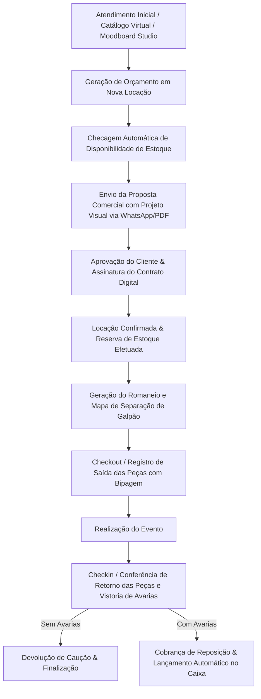

# 👑 SISTEMA CELEBRE — MANUAL TÉCNICO & RESUMO EXECUTIVO DO SISTEMA

> **Celebre - Sistema Especializado em Gestão de Festas, Eventos e Locação de Acervo**  
> *Documento técnico e operacional definitivo cobrindo 100% dos módulos, páginas, abas, fluxos e componentes do sistema.*

---

## 📑 SUMÁRIO EXECUTIVO

1. [Visão Geral e Arquitetura Tecnológica](#1-visão-geral-e-arquitetura-tecnológica)
2. [Modelagem de Dados & Coleções Firestore](#2-modelagem-de-dados--coleções-firestore)
3. [Navegação e Layout Base](#3-navegação-e-layout-base)
4. [Detalhamento de Módulos e Páginas](#4-detalhamento-de-módulos-e-páginas)
   - [4.1 Dashboard Principal (`/dashboard`)](#41-dashboard-principal-dashboard)
   - [4.2 Gestão de Locações (`/locacoes`)](#42-gestão-de-locações-locacoes)
   - [4.3 Gestão de Clientes (`/clientes`)](#43-gestão-de-clientes-clientes)
   - [4.4 Estoque e Acervo (`/estoque`)](#44-estoque-e-acervo-estoque)
   - [4.5 Financeiro & Fluxo de Caixa (`/financeiro`)](#45-financeiro--fluxo-de-caixa-financeiro)
   - [4.6 Compras e Reposições (`/compras`)](#46-compras-e-reposições-compras)
   - [4.7 Fornecedores (`/fornecedores`)](#47-fornecedores-fornecedores)
   - [4.8 Agenda de Eventos (`/agenda`)](#48-agenda-de-eventos-agenda)
   - [4.9 Logística, Galpão & Vistoria de Campo (`/logistica`)](#49-logística-roteiro-de-galpão--vistoria-de-campo-logistica)
   - [4.10 Contratos Digitais & Assinatura (`/contratos`)](#410-contratos-digitais--assinatura-contratos)
   - [4.11 Celebre Studio 4.0 — Moodboard & Cenografia Interativa (`/moodboard`)](#411-celebre-studio-40--moodboard--cenografia-interativa-moodboard)
   - [4.12 Catálogo Virtual & Vitrine (`/catalogo`)](#412-catálogo-virtual--vitrine-catalogo)
   - [4.13 Relatórios & Inteligência de Negócio (`/relatorios`)](#413-relatórios--inteligência-de-negócio-relatorios)
   - [4.14 Configurações do Sistema (`/configuracoes`)](#414-configurações-do-sistema-configuracoes)
   - [4.15 Central de Notificações (`/notificacoes`)](#415-central-de-notificações-notificacoes)
   - [4.16 Equipe & Controle ASO (`/Usuarios`)](#416-equipe--controle-aso-usuarios)
   - [4.17 Planos, Assinaturas & Painel Master Super Admin (`/planos` / `/admin`)](#417-planos-assinaturas--painel-master-super-admin-planos--admin)
5. [Workflows Operacionais Integrados](#5-workflows-operacionais-integrados)
6. [Regramento de Blindagem de Layout & UI/UX](#6-regramento-de-blindagem-de-layout--uiux)
7. [Resumo Executivo de Atualizações & Modernizações Recentes](#7-resumo-executivo-de-atualizações--modernizações-recentes)

---

## 1. VISÃO GERAL E ARQUITETURA TECNOLÓGICA

O **Sistema Celebre** foi desenvolvido para resolver as dores operacionais diárias de decoradoras de festas, galpões de locação de acervos e empresas do segmento "Pegue e Monte".

### 🛠️ Stack Tecnológica:
- **Core Frontend**: React 18+ impulsionado por **Vite** para compilação ultrarrápida.
- **Roteamento**: `react-router-dom` v6 com rotas dinâmicas, controle de estado de navegação e guardas de segurança.
- **Backend as a Service (BaaS)**: **Firebase**
  - *Firestore Database*: Banco de dados NoSQL em tempo real.
  - *Firebase Authentication*: Autenticação via e-mail/senha.
  - *Firebase Storage*: Armazenamento de imagens de produtos, fotos de avarias, comprovantes e contratos.
- **Inteligência Artificial no Navegador (Edge AI)**: `@imgly/background-removal` via WebAssembly (WASM) para remoção automática de fundo de fotos de peças e decorações, com processamento 100% local e sem custos de APIs externas.
- **Visualização de Dados**: `recharts` (Gráficos de Área, Barras e Donut responsivos).
- **Estilização**: Vanilla CSS 3 modularizado com CSS Variables (Design System Dark Luxury Enterprise com suporte nativo a responsividade mobile e dark/light tokens).
- **Geração de Documentos**: HTML5 Canvas, `html2canvas` e `jspdf` para exportação de orçamentos, propostas com imagem, contratos, comprovantes e romaneios.

### 🛡️ Arquitetura de Segurança & Multitenancy:
- **Isolamento de Dados (Multitenancy)**: Todos os documentos gravados nas coleções contêm a chave `tenantId`. Consultas Firestore utilizam obrigatoriamente `where('tenantId', '==', tenantId)`, garantindo isolamento total entre diferentes empresas.
- **Guardiões de Rota (`App.jsx`)**:
  - `RotaPrivada`: Exige autenticação de usuário ativo.
  - `RotaAdmin`: Restringe acesso a funções exclusivas do Super Admin (`celebrefesta25@gmail.com`).
  - `TravaSeguranca`: Componente de validação dupla que checa permissões por módulo (`Financeiro`, `Relatorios`, `Equipe`, `Moodboard`) para perfis de funcionários.

---

## 2. MODELAGEM DE DADOS & COLEÇÕES FIRESTORE

O sistema opera sobre um ecossistema NoSQL organizado nas seguintes coleções principais:

1. `locacoes`: Armazena dados de contratos, orçamentos, cliente associado, intervalo de datas (retirada, evento, devolução), tipo de serviço (Pegue e Monte vs. Decoração), lista de itens locados, valores (frete, desconto, sinal, caução, total), status e controle de devolução/avarias.
2. `clientes`: Registro de clientes com nome, CPF/CNPJ, WhatsApp, e-mail, endereço completo com CEP e notas de relacionamento.
3. `estoque`: Catálogo do acervo. Guarda SKU, nome, categoria, quantidade total, quantidade disponível, valor de locação, valor de reposição, dimensões, cor, estado e galeria de fotos.
4. `financeiro`: Registros de entradas (locações, vendas) e saídas (aluguel do galpão, pessoal, manutenção, compras), data de vencimento, data de pagamento, categoria, forma de pagamento e anexo.
5. `financeiro_recorrentes`: Cadastro de despesas fixas e salários mensais recorrentes (descrição, categoria, valor estimado, dia de vencimento, forma de pagamento, observações).
6. `compras`: Aquisições de peças de acervo e insumos (balões, fitas, embalagens) com vinculação a fornecedores e rastreio de prazos de entrega.
7. `fornecedores`: Parceiros comerciais, e-commerces (Mercado Livre, Shopee), artesãos, marceneiros e freteiros.
8. `contratos`: Minutas de contratos e instâncias de contratos assinados digitalmente.
9. `moodboard_elementos`: Biblioteca oficial e portfólio customizado de recortes PNG, arcos desconstruídos, painéis temáticos, texturas de parede, pisos e ambientes inteiros para o Moodboard Studio, gerenciados pelo Super Admin.
10. `projetos_moodboard`: Projetos e maquetes 2D/3D salvas com array de objetos do canvas, texturas de parede e piso, configurações de luz, desfoque óptico e proposta comercial.
11. `equipe`: Cadastro de colaboradores da empresa, seus cargos e mapa de permissões granulares por módulo.
12. `configuracoes`: Parâmetros da empresa (logo, chave PIX, endereço, dados da frota, margem de bloqueio de estoque).
13. `notificacoes`: Alertas do sistema referentes a atrasos e tarefas do dia.

---

## 3. NAVEGAÇÃO E LAYOUT BASE

O layout é composto por estruturas globais e isolamento de telas de estúdio:

- **`Navbar.jsx` (Menu Lateral / Drawer Mobile)**:
  - Navegação expansível com ícones para todos os módulos.
  - Exibição do plano ativo da empresa.
  - Badges de notificações em tempo real.
- **`Topbar.jsx` (Barra Superior Global)**:
  - Identificação da empresa e do usuário logado.
  - Atalho rápido de busca e central de notificações (`SininhoNotificacoes.jsx`).
  - Seletor de tema claro/escuro e logout.
- **Modo Estúdio Imersivo (`rotasSemMenu`)**:
  - A rota `/moodboard` opera em modo *Tela Cheia Dedicada*, ocultando Navbar e Topbar globais para fornecer 100% de área visual ao Canvas de criação, com botão próprio de retorno ao Início.

---

## 4. DETALHAMENTO DE MÓDULOS E PÁGINAS

---

### 4.1 Dashboard Principal (`/dashboard`)
Página central de inteligência e controle de fluxo do negócio.
- **Cards KPI**: Total de locações ativas, faturamento do mês, devoluções pendentes e itens em manutenção.
- **Próximos Eventos & Saídas**: Lista cronológica de retiradas e entregas programadas.
- **Gráficos de Desempenho**: Faturamento por período e itens mais locados do acervo.

---

### 4.2 Gestão de Locações (`/locacoes`)
- **Lista de Locações (`Locacoes.jsx`)**:
  - Tabela responsiva com busca por cliente, número de contrato, intervalo de datas e status.
  - Filtro por abas de status: *Orçamentos*, *Confirmados*, *Em Separação*, *Entregues*, *Concluídos*, *Cancelados*.
  - Ações em massa e atalhos de alteração de status.
- **Nova Locação / Edição (`NovaLocacao.jsx`)**:
  - Simulador de disponibilidade em tempo real por intervalo de datas.
  - Seleção visual de acervos com leitor de SKU e filtros de categoria.
  - Cálculo automático de frete dinâmico por geolocalização e consumo veicular.
  - Cálculo automático de desconto, valor de sinal e caução.
- **Visualizador de Contrato (`VisualizarLocacao.jsx`)**:
  - Emissão de contrato com minuta dinâmica, espelho do pedido e botão para envio via WhatsApp ou PDF.
- **Romaneio & Expedição (`RomaneioModal.jsx`)**:
  - Lista de separação de peças para equipe de galpão com caixas de checagem.

---

### 4.3 Gestão de Clientes (`/clientes`)
- **Painel de Clientes (`Clientes.jsx`)**:
  - Lista completa de clientes cadastrados com estatísticas de locação.
- **Novo Cliente / Edição (`NovoCliente.jsx`)**:
  - Formulário completo com consulta de CEP automática, CPF/CNPJ, WhatsApp formatado e campo de observações comportamentais.

---

### 4.4 Estoque e Acervo (`/estoque`)
- **Catálogo de Estoque (`Estoque.jsx`)**:
  - Visualização em Grid de Cards ou Tabela com foto, SKU, categoria, peças totais, disponíveis e quebradas.
  - Filtro por disponibilidade em data específica.
- **Cadastro de Item (`CadastroEstoque.jsx`)**:
  - Upload de fotos para o Firebase Storage.
  - Cadastro de SKU, dimensões, cor, valor de locação e valor de reposição (para cobrança de avarias).
  - Definição de formato: *Peça Avulsa* vs *Kit / Conjunto*.

---

### 4.5 Financeiro & Fluxo de Caixa (`/financeiro`)
Página unificada com arquitetura de 3 abas sem descontinuidade visual ou quebra de layout:
- **Aba 1: 📊 Fluxo de Caixa (`lancamentos`)**:
  - 4 Cards KPI protegidos (Faturamento Bruto, Total Saídas, Saldo Operacional, Saldo Líquido com Estimativa de Fechamento).
  - Barra de formas de pagamento em chips com ícones (`⚡ Pix`, `💳 Cartão`, `💵 Dinheiro`, `📄 Boleto`).
  - Tabela dinâmica de lançamentos com status de quitação, visualização de anexos e filtros por período e categoria.
  - Widget de Distribuição por Categoria com gráfico de rosca Donut + barras de progresso visual.
  - Exportação de dados em CSV / Excel (`📥 Exportar (.CSV)`).
- **Aba 2: 📎 Comprovantes (`comprovantes`)**:
  - Central de auditoria com galeria de comprovantes de pagamento e recebimento anexados.
  - Modal de ampliação em alta definição via React Portal (`document.body`) com suporte a imagens e visualizador de PDF, download e impressão.
- **Aba 3: 🏢 Contas Fixas & Despesas Recorrentes (`contas-fixas`)**:
  - Gestão de folha salarial e despesas estruturais (Aluguel, Energia, Internet, Pró-labore, Diárias).
  - 4 Cards KPI dedicados: *Custo Fixo Total Estimado*, *Equipe & Pessoal*, *Infra & Despesas Fixas* e *Status em Mês Vigente*.
  - **Modal Celebre VIP de Cadastro/Edição**: Renderizado no `document.body` via React Portal com `backdrop-filter: blur(14px)`, layout 2x2 otimizado, máscara monetária em tempo real e foco inteligente.
  - **Lançamento Automático em 1 Clique**: Botão `⚡ Lançar no Caixa` que cria a despesa no fluxo de caixa e atualiza o status de lançamento no mês alvo.

---

### 4.6 Compras e Reposições (`/compras`)
- **Gestão de Compras (`Compras.jsx`)**:
  - Registro de compras de reposição de acervo avariado, investimento em novos temas e aquisição de descartáveis/insumos.
  - Exportação e envio de lista de compras para WhatsApp ou PDF.
- **Nova Compra com Redesign SaaS Premium (`NovaCompra.jsx`)**:
  - Dark Hero Header com gradiente dourado (`#0f172a` a `#1e293b`).
  - Stepper Workflow em 3 passos lógicos.
  - Segmentação inteligente (*Reposição de Acervo* vs *Pedido Específico vinculado a evento*).
  - Campos financeiros lado a lado em 2 colunas (`.nc-grid-2`).
  - Modal de busca inteligente de fornecedores com atalhos para marketplaces (*Mercado Livre*, *Shopee*).

---

### 4.7 Fornecedores (`/fornecedores`)
- **Painel de Fornecedores (`Fornecedores.jsx`)**:
  - Cadastro de parceiros, e-commerces, marceneiros, pintores, freteiros e lojas de insumos.
- **Novo Fornecedor (`NovoFornecedor.jsx`)**:
  - Formulário com razão social, contato do vendedor, WhatsApp, chave PIX e categoria de fornecimento.

---

### 4.8 Agenda de Eventos (`/agenda`)
- **Calendário da Decora (`Agenda.jsx`)**:
  - Calendário interativo com modos Mês, Semana e Dia.
  - Marcadores coloridos diferenciando:
    - 🚚 *Data de Retirada/Entrega*
    - 🎉 *Data da Festa/Evento*
    - 📦 *Data de Devolução/Recolhe*

---

### 4.9 Logística, Roteiro de Galpão & Vistoria de Campo (`/logistica`)
- **Esteira Kanban de Galpão em 4 Etapas (`Logistica.jsx`, `Logistica.css`)**:
  - `1. A Separar`: Pedidos confirmados e aprovados aguardando início da separação de galpão.
  - `2. Em Separação`: Separação ativa no acervo com checklist de itens, leitor de código de barras e controle de caixas.
  - `3. Na Rua / Evento`: Pedidos em trânsito, montados no buffet/residência ou em realização do evento.
  - `4. Devolvidos`: Retorno do material ao galpão para vistoria de devolução, baixa de estoque e lançamento de avarias.
- **Sistema de Vistoria de Devolução & Saída (`ModalCheckinLocacao.jsx`, `ModalCheckinLocacao.css`)**:
  - Modal flutuante luxury com 2 colunas no Desktop (980px) e card flutuante responsivo no celular (`border-radius: 16px`).
  - Steppers fracionados de conferência `[-] 0 [+] [Max]` para cada peça e botões de status (`🟢 OK`, `🛠️ Avaria`, `❌ Falta`).
  - Câmera ao vivo para bipagem de QR Code e Código de Barras dos caixotes/peças.
  - Máscara monetária BRL automática em tempo real para registro de custos de reposição/avaria.
  - Lançamento financeiro automático da cobrança de avarias direto no Fluxo de Caixa.
  - Anexo de fotos de vistoria e Canvas de Assinatura Digital Touch (`touch-action: none`) sem rolagem da tela.
- **Gestão de Transporte, Motorista & Embalagens Retornáveis (`ModalDesignarMotorista.jsx`)**:
  - Atribuição rápida de motorista/equipe e veículo designado.
  - Controle e contagem de embalagens retornáveis de galpão (Caixas Plásticas, Sacolas e Capas de Painel).
  - Campo de instruções de rota para motorista com impressão direta na Folha de Campo.
- **Ecossistema de Documentos & Relatórios em PDF da Logística**:
  - `gerarRomaneioPDF.js`: Romaneio de Carga & Rota do Motorista com lista de entregas, coletas e saldo a receber.
  - `gerarFolhaSeparacaoGalpaoPDF.js`: Mapa Geral de Separação de Peças consolidado por período.
  - `gerarComprovanteCheckinPDF.js`: Comprovante oficial de vistoria e conferência de devolução/saída com dados do responsável e assinatura.
  - `gerarEtiquetasCaixotePDF.js`: Etiquetas de expedição para colar nos caixotes antes da saída do galpão.

---

### 4.10 Contratos Digitais & Assinatura (`/contratos`)
- **Gerenciador de Contratos (`Contratos.jsx`)**:
  - Painel de contratos gerados, assinados e pendentes.
- **Assinatura Digital (`AssinaturaContrato.jsx`)**:
  - Interface para o cliente assinar o contrato digitalmente pelo celular.

---

### 4.11 Celebre Studio 4.0 — Moodboard & Cenografia Interativa (`/moodboard`)
O estúdio criativo do sistema é uma ferramenta profissional especializada no mercado de festas:

- **1. Cenografia Oficial Exclusiva Super Admin**:
  - Todos os presets estáticos de imagens externas foram removidos.
  - Exibição de paredes, pisos e ambientes inteiros carregados dinamicamente do Firestore e cadastrados exclusivamente pelo Super Admin.
- **2. Enquadramento, Movimentação & Zoom de Cenário (Pan & Zoom)**:
  - **↕️ Posição Vertical (0% a 100%)**: Move a imagem para cima e para baixo para enquadrar a melhor área fotográfica.
  - **↔️ Posição Horizontal (0% a 100%)**: Move a imagem para a esquerda ou direita.
  - **🔍 Zoom / Escala (80% a 250%)**: Ajusta o tamanho da textura de tijolos, piso ou foto do salão.
  - **↺ Centralizar**: Botão de 1 clique para resetar os eixos.
- **3. Foco Óptico & Profundidade 3D (Bokeh)**:
  - Slider `📷 Profundidade de Tela / Desfoque (0 a 10px)` que aplica desfoque suave de profundidade de campo (*bokeh* óptico) no fundo, destacando as peças em primeiro plano com visual cinematográfico.
- **4. Cenários Modulares (Parede + Piso) vs. Fotos de Salão (Ambiente Inteiro)**:
  - *Ambiente Inteiro*: Ao selecionar foto de salão/jardim, ativa o **Modo Fundo Único**, cobrindo 100% da prancheta sem chão artificial sobreposto.
  - *Parede + Piso*: Ativa o **Modo Duplo**, com ciclorama 3D, sombra de oclusão de contato (`0% a 60%`), altura da linha do chão (`15% a 55%`) e opção de rodapé de estúdio.
- **5. Remoção Automática de Fundo com IA Local (WASM)**:
  - Integração do modelo `@imgly/background-removal` rodando 100% no navegador do usuário, recortando fotos instantaneamente.
- **6. Catálogo com 12 Estruturas Vetoriais Cenográficas**:
  - Painéis romanos, redondos, retangulares, hexagonais, nichos, meia-lua, mesas, cilindros, arcos orgânicos de balões, guirlandas e tipografia metálica (Gold Mirror, Rose Gold, Silver, MDF Wood e Glitter).
- **7. Indicador Comercial "A Comprar"**:
  - Badge pulsante para peças não disponíveis no estoque físico da decoradora e botão **`👑 GERAR LOCAÇÃO`** para converter a maquete visual em pedido formal.
- **8. Arquitetura Mobile-First Bottom Sheet**:
  - Canvas em tela cheia, dock inferior e drawer com gesto de deslizar (*swipe down*).

---

### 4.12 Catálogo Virtual & Vitrine (`/catalogo`)
- **Vitrine Virtual (`Catalago.jsx`)**:
  - Galeria de acervos e temas prontos organizada para enviar a clientes via WhatsApp.

---

### 4.13 Relatórios & Inteligência de Negócio (`/relatorios`)
Dividido em 4 abas analíticas avançadas:
1. **Pedidos (`PedidosTab.jsx`)**: Taxa de conversão, ticket médio e volume contratado.
2. **Estoque (`EstoqueTab.jsx`)**: Curva ABC, valoração de acervo físico e peças ociosas.
3. **Financeiro (`FinanceiroTab.jsx`)**: DRE Gerencial, Livro Caixa auditado e indicadores de margem.
4. **Clientes (`ClientesTab.jsx`)**: Recompra, LTV e ranking de cidades com mais festas.

---

### 4.14 Configurações do Sistema (`/configuracoes`)
- Gestão de dados da empresa, chave PIX, logomarca, frota de veículos, permissões de equipe, margem de bloqueio de estoque e cópia de segurança (Backup).

---

### 4.15 Central de Notificações (`/notificacoes`)
- Alertas em tempo real sobre devoluções pendentes, cobranças e tarefas logísticas do dia.

---

### 4.16 Equipe & Controle ASO (`/Usuarios`)
- Gerenciamento de acessos da equipe de galpão e atendimento, logs de auditoria e controle de ASO.

---

### 4.17 Planos, Assinaturas & Painel Master Super Admin (`/planos` / `/admin`)
- **Painel Master / Controle Geral (`ControleGeral.jsx`, `ControleGeral.css`)**:
  - Acesso restrito ao Super Admin (`celebrefesta25@gmail.com`).
  - Largura padronizada a 100% da tela (`.cg-wrapper.fade-in`).
  - Dropdown compacto de categorias e pílulas de status sem barra de rolagem horizontal extensa.
  - Subchips contextuais inteligentes no cadastro de cenários (Paredes: *Cor Lisa, Ripado, Tijolo, Janela*; Pisos: *Madeira, Porcelanato, Grama*; Ambientes: *Salão Nobre, Jardim, Rústico*).
  - Gestão e liberação global de elementos para todos os clientes da plataforma SaaS.

---

## 5. WORKFLOWS OPERACIONAIS INTEGRADOS

---

## 6. REGRAMENTO DE BLINDAGEM DE LAYOUT & UI/UX

### 🔒 Regra de Ouro 1: Layout dos Cards KPI no Desktop (1 Única Linha)
- A classe `.clientes-stats-grid` em **TODAS** as páginas (`Locacoes`, `Clientes`, `Estoque`, `Compras`, `Financeiro`) **DEVE PERMANECER OBRIGATORIAMENTE EM 1 SÓ LINHA HORIZONTAL (`flex-wrap: nowrap !important; display: flex !important;`)** no desktop (`> 900px`).
- **NUNCA** permitir que os cards dobrem para 2 linhas no desktop. Todos os cards ajustam-se proporcionalmente lado a lado.

### 🔒 Regra de Ouro 2: Layout dos Cards KPI no Celular (2 Colunas)
- A classe `.clientes-stats-grid` em **TODAS** as páginas **DEVE PERMANECER OBRIGATORIAMENTE EM 2 COLUNAS** no celular/telas menores (`<= 900px`).
- A regra global em `src/App.css` e nas páginas específicas utiliza `grid-template-columns: repeat(2, 1fr) !important;`.

### 🔒 Regra de Ouro 3: Preservação de CSS e Estilos Visuais
- Arquivos de estilização CSS (`Locacoes.css`, `Clientes.css`, `Estoque.css`, `Compras.css`, `ModalCalendarioDisponibilidade.css`) estão **BLINDADOS**.
- Não alterar classes globais de grid sem verificar o impacto em todas as telas da aplicação.

---

## 7. RESUMO EXECUTIVO DE ATUALIZAÇÕES & MODERNIZAÇÕES RECENTES

### 7.1. Celebre Studio 4.0 — Moodboard, Cenografia & Profundidade 3D
- **Exclusividade de Cenários do Super Admin**: Remoção de presets estáticos genéricos; liberação das coleções oficiais de Paredes, Pisos e Ambientes Inteiros alimentadas via Firestore.
- **Movimentação Livre, Pan & Zoom**: Sliders de posição vertical (Y), horizontal (X) e zoom (80% a 250%) com botão de reset de 1 clique.
- **Foco Óptico / Bokeh**: Controle de profundidade e desfoque suave de fundo (0 a 10px).
- **Modo Único vs Duplo**: Fotos inteiras cobrem 100% da tela contínua; estúdios modulares aplicam ciclorama 3D com sombra de oclusão de contato e ajuste de linha do chão.
- **Expansão de Espaço Vertical**: Grid de texturas sem barra de rolagem reduzida, utilizando toda a área do painel lateral.
- **Blindagem de Compatibilidade CSS**: Inclusão de `background-clip: text` em todos os materiais e letreiros realistas.

### 7.2. Painel Master Super Admin (`ControleGeral.jsx` & `ControleGeral.css`)
- **Largura 100% Padronizada**: Alinhamento visual pleno com as páginas principais do sistema.
- **Toolbar Compacta**: Eliminação da fita horizontal com dropdown ágil de categorias e subfiltros contextuais.
- **Cadastro Inteligente de Cenários**: Ocultação da paleta pesada de balões e exibição de chips de subtipos específicos de acordo com a categoria selecionada.

### 7.3. Página de Financeiro (`Financeiro.jsx` & `Financeiro.css`)
- **Arquitetura Unificada de 3 Abas**: `Fluxo de Caixa`, `Comprovantes` e `Contas Fixas` integradas com cards KPI protegidos e exportação CSV.
- **Módulo de Contas Fixas VIP**: 4 Cards KPI, lançamento de despesa em 1 clique e modal de cadastro via React Portal.

### 7.4. Logística, Galpão & Vistorias de Campo
- **Esteira Kanban de 4 Etapas**, vistoria touch com bipagem e assinatura digital, e ecossistema de PDFs (Romaneio, Folha de Separação, Comprovante de Check-in e Etiquetas de Caixote).

### 7.5. Inteligência de Frete & Lucro Real da Festa
- **Cálculo de Frete por GPS/CEP e tipo de veículo**, com apuração do lucro real abatendo custos operacionais e de transporte.

### 7.6. Celebre Studio 4.0 — Reorganização do Fluxo de Trabalho da Toolbar

**Data:** 19/08/2026 | **Arquivos:** `Moodboard.jsx`, `Moodboard.css`

A ordem da barra lateral (toolbar) foi completamente reorganizada para seguir o fluxo lógico e natural de uma decoradora profissional — do palco às peças, até os detalhes finais:

| Posição | Aba | Finalidade |
|---------|-----|------------|
| 1ª | 🏞️ **Cenário** | Define o palco — parede, piso 3D ou salão inteiro |
| 2ª | 🏛️ **Estruturas** | Arcos romanos, painéis temáticos, cilindros, mesas |
| 3ª | 📦 **Acervo** | Estoque próprio + elementos PNG globais + upload rápido |
| 4ª | ✨ **Efeitos** | Efeitos visuais e atmosfera do ambiente (ver 7.7) |
| 5ª | 🎈 **Bexigas** | Arcos orgânicos, guirlandas, balões cluster e colunas |
| 6ª | ✍️ **Letreiros** | Texto, fontes artísticas, materiais realistas e apliques |

**Mudanças adicionais:**
- Estado inicial da aba ao abrir o Moodboard alterado para `'fundo'` (Cenário) — o usuário começa pelo palco.
- Labels do Bottom Sheet mobile atualizados para refletir a nova nomenclatura.
- Ícone `Sun` adicionado ao objeto `Icons` para a aba Efeitos.

---

### 7.7. Celebre Studio 4.0 — Nova Aba ✨ Efeitos & Iluminação

**Data:** 19/08/2026 | **Arquivos:** `Moodboard.jsx`, `Moodboard.css`

Implementação da nova aba de efeitos visuais globais do ambiente, com controles em tempo real:

#### Controles CSS Globais (aplicados via `filter` no `canvas-layers`):
- **☀️ Luminosidade** (30–200%): Ajusta o brilho geral da cena — de estúdio escuro a ambiente externo.
- **🎨 Contraste** (30–200%): Define a dramaticidade visual — de suave a cinematográfico.
- **🌈 Saturação** (0–250%): De preto e branco total a cores super-vívidas e festivas.
- **🌫️ Profundidade de Foco** (0–15px): Desfoque bokeh do cenário de fundo (movido do painel Cenário).

#### Overlays Visuais (camadas renderizadas no artboard):
- **🌅 Tonalidade de Cor**: Paleta de 14 tons (claros e escuros) com `mix-blend-mode: color` e intensidade ajustável (0–80%) — permite tingir a cena com tons dourados, azulados, rosados ou dramáticos.
- **🕸️ Vinheta** (0–100%): Gradiente radial que escurece as bordas da cena, criando foco visual no centro.
- **🔄 Resetar Tudo**: Botão que zera todos os efeitos de uma só vez.

#### Arquitetura técnica:
- Estados: `luminosidadeGlobal`, `contrasteGlobal`, `saturacaoGlobal`, `tonalidadeCor`, `tonalidadeIntensidade`, `vignettaIntensidade`.
- Filtros compostos com `Array.filter(Boolean).join(' ')` para eficiência.
- Overlays com `position: absolute; inset: 0; pointer-events: none` para não interferir na interação.

#### 📌 PRÓXIMA EVOLUÇÃO PLANEJADA — Efeitos Animados de Partículas:
A aba de Efeitos evoluirá para incluir atmosferas animadas em tempo real:

| Efeito | Descrição técnica |
|--------|-------------------|
| 🎊 **Confete no Ar** | Partículas coloridas caindo com CSS `@keyframes` |
| 🫧 **Bolhas de Sabão** | Círculos translúcidos flutuando com `border-radius: 50%` |
| 🌅 **Pôr do Sol** | Gradiente dinâmico laranja/dourado com transição suave |
| 🌧️ **Chuva** | Linhas diagonais animadas sobrepostas |
| ✨ **Faíscas/Brilhos** | Partículas de luz piscando (efeito estrelas) |
| 💡 **Iluminação de Palco** | Holofotes simulados com gradientes radiais |

---

*Manual técnico e Resumo Executivo atualizados em 19/08/2026 — Sistema Celebre v4.0*
