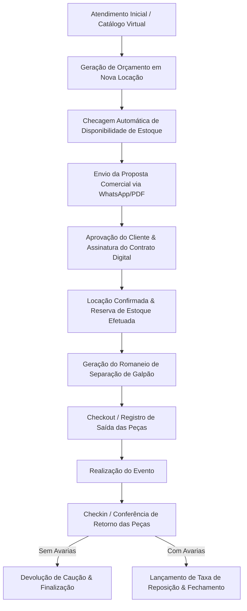

# 👑 SISTEMA CELEBRE — MANUAL TÉCNICO & RESUMO EXECUTIVO DO SISTEMA

> **Celebre - Sistema Especializado em Gestão de Festas, Eventos e Locação de Acervo**  
> *Documento técnico e operacional definitivo cobrindo 100% dos módulos, páginas, abas, fluxos e componentes do sistema.*

---

## 📑 SUMÁRIO EXECUTIVO

1. [Visão Geral e Arquitetura Tecnológica](#1-visão-geral-e-arquitetura-tecnológica)
2. [Modelagem de Dados & Coleções Firestore](#2-modelagem-de-dados--coleções-firestore)
3. [Navegação e Layout Base](#3-navegação-e-layout-base)
4. [Detalhamento de Módulos e Páginas](#4-detalhamento-de-módulos-e-páginas)
   - [4.1 Dashboard Principal (`/dashboard`)](#41-dashboard-principal-dashboard)
   - [4.2 Gestão de Locações (`/locacoes`)](#42-gestão-de-locações-locacoes)
   - [4.3 Gestão de Clientes (`/clientes`)](#43-gestão-de-clientes-clientes)
   - [4.4 Estoque e Acervo (`/estoque`)](#44-estoque-e-acervo-estoque)
   - [4.5 Financeiro & Fluxo de Caixa (`/financeiro`)](#45-financeiro--fluxo-de-caixa-financeiro)
   - [4.6 Compras e Reposições (`/compras`)](#46-compras-e-reposições-compras)
   - [4.7 Fornecedores (`/fornecedores`)](#47-fornecedores-fornecedores)
   - [4.8 Agenda de Eventos (`/agenda`)](#48-agenda-de-eventos-agenda)
   - [4.9 Logística & Carregamento (`/logistica`)](#49-logística--carregamento-logistica)
   - [4.10 Contratos Digitais & Assinatura (`/contratos`)](#410-contratos-digitais--assinatura-contratos)
   - [4.11 Moodboard & Projetos Visuais (`/moodboard`)](#411-moodboard--projetos-visuais-moodboard)
   - [4.12 Catálogo Virtual & Vitrine (`/catalogo`)](#412-catálogo-virtual--vitrine-catalogo)
   - [4.13 Relatórios & Inteligência de Negócio (`/relatorios`)](#413-relatórios--inteligência-de-negócio-relatorios)
   - [4.14 Configurações do Sistema (`/configuracoes`)](#414-configurações-do-sistema-configuracoes)
   - [4.15 Central de Notificações (`/notificacoes`)](#415-central-de-notificações-notificacoes)
   - [4.16 Equipe & Controle ASO (`/Usuarios`)](#416-equipe--controle-aso-usuarios)
   - [4.17 Planos, Assinaturas & Painel Admin (`/planos` / `/admin`)](#417-planos-assinaturas--painel-admin-planos--admin)
5. [Workflows Operacionais Integrados](#5-workflows-operacionais-integrados)
6. [Regramento de Blindagem de Layout & UI/UX](#6-regramento-de-blindagem-de-layout--uiux)
7. [Resumo Executivo de Atualizações & Modernizações Recentes](#7-resumo-executivo-de-atualizações--modernizações-recentes)

---

## 1. VISÃO GERAL E ARQUITETURA TECNOLÓGICA

O **Sistema Celebre** foi desenvolvido para resolver as dores operacionais diárias de decoradoras de festas, galpões de locação de acervos e empresas do segmento "Pegue e Monte".

### 🛠️ Stack Tecnológica:
- **Core Frontend**: React 18+ impulsionado por **Vite** para compilação ultrarrápida.
- **Roteamento**: `react-router-dom` v6 com rotas dinâmicas, controle de estado de navegação e guardas de segurança.
- **Backend as a Service (BaaS)**: **Firebase**
  - *Firestore Database*: Banco de dados NoSQL em tempo real.
  - *Firebase Authentication*: Autenticação via e-mail/senha.
  - *Firebase Storage*: Armazenamento de imagens de produtos, fotos de avarias, comprovantes e contratos.
- **Visualização de Dados**: `recharts` (Gráficos de Área, Barras e Donut responsivos).
- **Estilização**: Vanilla CSS 3 modularizado com CSS Variables (Design System Enterprise com suporte nativo a responsividade mobile e dark/light tokens).
- **Geração de Documentos**: HTML5 Canvas e utilitários para impressão térmica e exportação em PDF.

### 🛡️ Arquitetura de Segurança & Multitenancy:
- **Isolamento de Dados (Multitenancy)**: Todos os documentos gravados nas coleções contêm a chave `tenantId`. Consultas Firestore utilizam obrigatoriamente `where('tenantId', '==', tenantId)`, garantindo isolamento total entre diferentes empresas.
- **Guardiões de Rota (`App.jsx`)**:
  - `RotaPrivada`: Exige autenticação de usuário ativo.
  - `RotaAdmin`: Restringe acesso a funções exclusivas do Super Admin.
  - `TravaSeguranca`: Componente de validação dupla que checa permissões por módulo (`Financeiro`, `Relatorios`, `Equipe`) para perfis de funcionários.

---

## 2. MODELAGEM DE DADOS & COLEÇÕES FIRESTORE

O sistema opera sobre um ecossistema NoSQL organizado nas seguintes coleções principais:

1. `locacoes`: Armazena dados de contratos, orçamentos, cliente associado, intervalo de datas (retirada, evento, devolução), tipo de serviço (Pegue e Monte vs. Decoração), lista de itens locados, valores (frete, desconto, sinal, caução, total), status e controle de devolução/avarias.
2. `clientes`: Registro de clientes com nome, CPF/CNPJ, WhatsApp, e-mail, endereço completo com CEP e notas de relacionamento.
3. `estoque`: Catálogo do acervo. Guarda SKU, nome, categoria, quantidade total, quantidade disponível, valor de locação, valor de reposição, dimensões, cor, estado e galeria de fotos.
4. `financeiro`: Registros de entradas (locações, vendas) e saídas (aluguel do galpão, pessoal, manutenção, compras), data de vencimento, data de pagamento, categoria, forma de pagamento e anexo.
5. `financeiro_recorrentes`: Cadastro de despesas fixas e salários mensais recorrentes (descrição, categoria, valor estimado, dia de vencimento, forma de pagamento, observações).
6. `compras`: Aquisições de peças de acervo e insumos (balões, fitas, embalagens) com vinculação a fornecedores e rastreio de prazos de entrega.
7. `fornecedores`: Parceiros comerciais, e-commerces (Mercado Livre, Shopee), artesãos, marceneiros e freteiros.
8. `contratos`: Minutas de contratos e instâncias de contratos assinados digitalmente.
9. `equipe`: Cadastro de colaboradores da empresa, seus cargos e mapa de permissões granulares por módulo.
10. `configuracoes`: Parâmetros da empresa (logo, chave PIX, endereço, margem de bloqueio de estoque).
11. `notificacoes`: Alertas do sistema referentes a atrasos e tarefas do dia.

---

## 3. NAVEGAÇÃO E LAYOUT BASE

O layout é composto por três estruturas globais:

- **`Navbar.jsx` (Menu Lateral / Drawer Mobile)**:
  - Navegação expansível com ícones para todos os módulos.
  - Exibição do plano ativo da empresa.
  - Badges de notificações em tempo real.
- **`Topbar.jsx` (Barra Superior)**:
  - Identificação da empresa e do usuário logado.
  - Atalho rápido de busca e central de notificações (`SininhoNotificacoes.jsx`).
  - Botão de logout seguro.
- **`SininhoNotificacoes.jsx`**:
  - Popover inteligente com alertas de locações a saírem hoje, devoluções vencendo ou atrasadas.

---

## 4. DETALHAMENTO DE MÓDULOS E PÁGINAS

---

### 4.1 Dashboard Principal (`/dashboard`)
Página central de inteligência e controle de fluxo do negócio.
- **Cards KPI**: Total de locações ativas, faturamento do mês, devoluções pendentes e itens em manutenção.
- **Próximos Eventos & Saídas**: Lista cronológica de retiradas e entregas programadas.
- **Gráficos de Desempenho**: Faturamento por período e itens mais locados do acervo.

---

### 4.2 Gestão de Locações (`/locacoes`)
- **Lista de Locações (`Locacoes.jsx`)**:
  - Tabela responsiva com busca por cliente, número de contrato, intervalo de datas e status.
  - Filtro por abas de status: *Orçamentos*, *Confirmados*, *Em Separação*, *Entregues*, *Concluídos*, *Cancelados*.
  - Ações em massa e atalhos de alteração de status.
- **Nova Locação / Edição (`NovaLocacao.jsx`)**:
  - Simulador de disponibilidade em tempo real por intervalo de datas.
  - Seleção visual de acervos com leitor de SKU e filtros de categoria.
  - Cálculo automático de frete, desconto, valor de sinal e caução.
- **Visualizador de Contrato (`VisualizarLocacao.jsx`)**:
  - Emissão de contrato com minuta dinâmica, espelho do pedido e botão para envio via WhatsApp ou PDF.
- **Romaneio & Expedição (`RomaneioModal.jsx`)**:
  - Lista de separação de peças para equipe de galpão com caixas de checagem.

---

### 4.3 Gestão de Clientes (`/clientes`)
- **Painel de Clientes (`Clientes.jsx`)**:
  - Lista completa de clientes cadastrados com estatísticas de locação.
- **Novo Cliente / Edição (`NovoCliente.jsx`)**:
  - Formulário completo com consulta de CEP automática, CPF/CNPJ, WhatsApp formatado e campo de observações comportamentais.

---

### 4.4 Estoque e Acervo (`/estoque`)
- **Catálogo de Estoque (`Estoque.jsx`)**:
  - Visualização em Grid de Cards ou Tabela com foto, SKU, categoria, peças totais, disponíveis e quebradas.
  - Filtro por disponibilidade em data específica.
- **Cadastro de Item (`CadastroEstoque.jsx`)**:
  - Upload de fotos para o Firebase Storage.
  - Cadastro de SKU, dimensões, cor, valor de locação e valor de reposição (para cobrança de avarias).
  - Definição de formato: *Peça Avulsa* vs *Kit / Conjunto*.

---

### 4.5 Financeiro & Fluxo de Caixa (`/financeiro`)
Página unificada com arquitetura de 3 abas sem descontinuidade visual ou quebra de layout:
- **Aba 1: 📊 Fluxo de Caixa (`lancamentos`)**:
  - 4 Cards KPI protegidos (Faturamento Bruto, Total Saídas, Saldo Operacional, Saldo Líquido com Estimativa de Fechamento).
  - Barra de formas de pagamento em chips com ícones (`⚡ Pix`, `💳 Cartão`, `💵 Dinheiro`, `📄 Boleto`).
  - Tabela dinâmica de lançamentos com status de quitação, visualização de anexos e filtros por período e categoria.
  - Widget de Distribuição por Categoria com gráfico de rosca Donut + barras de progresso visual.
  - Exportação de dados em CSV / Excel (`📥 Exportar (.CSV)`).
- **Aba 2: 📎 Comprovantes (`comprovantes`)**:
  - Central de auditoria com galeria de comprovantes de pagamento e recebimento anexados.
  - Modal de ampliação em alta definição via React Portal (`document.body`) com suporte a imagens e visualizador de PDF, download e impressão.
- **Aba 3: 🏢 Contas Fixas & Despesas Recorrentes (`contas-fixas`)**:
  - Gestão de folha salarial e despesas estruturais (Aluguel, Energia, Internet, Pró-labore, Diárias).
  - 4 Cards KPI dedicados: *Custo Fixo Total Estimado*, *Equipe & Pessoal*, *Infra & Despesas Fixas* e *Status em Mês Vigente*.
  - **Modal Celebre VIP de Cadastro/Edição**: Renderizado no `document.body` via React Portal com `backdrop-filter: blur(14px)`, layout 2x2 otimizado, máscara monetária em tempo real e foco inteligente.
  - **Lançamento Automático em 1 Clique**: Botão `⚡ Lançar no Caixa` que cria a despesa no fluxo de caixa e atualiza o status de lançamento no mês alvo.

---

### 4.6 Compras e Reposições (`/compras`)
- **Gestão de Compras (`Compras.jsx`)**:
  - Registro de compras de reposição de acervo avariado, investimento em novos temas e aquisição de descartáveis/insumos.
  - Exportação e envio de lista de compras para WhatsApp ou PDF.
- **Nova Compra com Redesign SaaS Premium (`NovaCompra.jsx`)**:
  - Dark Hero Header com gradiente dourado (`#0f172a` a `#1e293b`).
  - Stepper Workflow em 3 passos lógicos.
  - Segmentação inteligente (*Reposição de Acervo* vs *Pedido Específico vinculado a evento*).
  - Campos financeiros lado a lado em 2 colunas (`.nc-grid-2`).
  - Modal de busca inteligente de fornecedores com atalhos para marketplaces (*Mercado Livre*, *Shopee*).

---

### 4.7 Fornecedores (`/fornecedores`)
- **Painel de Fornecedores (`Fornecedores.jsx`)**:
  - Cadastro de parceiros, e-commerces, marceneiros, pintores, freteiros e lojas de insumos.
- **Novo Fornecedor (`NovoFornecedor.jsx`)**:
  - Formulário com razão social, contato do vendedor, WhatsApp, chave PIX e categoria de fornecimento.

---

### 4.8 Agenda de Eventos (`/agenda`)
- **Calendário da Decora (`Agenda.jsx`)**:
  - Calendário interativo com modos Mês, Semana e Dia.
  - Marcadores coloridos diferenciando:
    - 🚚 *Data de Retirada/Entrega*
    - 🎉 *Data da Festa/Evento*
    - 📦 *Data de Devolução/Recolhe*

---

### 4.9 Logística, Roteiro de Galpão & Vistoria de Campo (`/logistica`)
- **Esteira Kanban de Galpão em 4 Etapas (`Logistica.jsx`, `Logistica.css`)**:
  - `1. A Separar`: Pedidos confirmados e aprovados aguardando início da separação de galpão.
  - `2. Em Separação`: Separação ativa no acervo com checklist de itens, leitor de código de barras e controle de caixas.
  - `3. Na Rua / Evento`: Pedidos em trânsito, montados no buffet/residência ou em realização do evento.
  - `4. Devolvidos`: Retorno do material ao galpão para vistoria de devolução, baixa de estoque e lançamento de avarias.
- **Sistema de Vistoria de Devolução & Saída (`ModalCheckinLocacao.jsx`, `ModalCheckinLocacao.css`)**:
  - Modal flutuante luxury com 2 colunas no Desktop (980px) e card flutuante responsivo no celular (`border-radius: 16px`).
  - Steppers fracionados de conferência `[-] 0 [+] [Max]` para cada peça e botões de status (`🟢 OK`, `🛠️ Avaria`, `❌ Falta`).
  - Câmera ao vivo para bipagem de QR Code e Código de Barras dos caixotes/peças.
  - Máscara monetária BRL automática em tempo real para registro de custos de reposição/avaria.
  - Lançamento financeiro automático da cobrança de avarias direto no Fluxo de Caixa.
  - Anexo de fotos de vistoria e Canvas de Assinatura Digital Touch (`touch-action: none`) sem rolagem da tela.
- **Gestão de Transporte, Motorista & Embalagens Retornáveis (`ModalDesignarMotorista.jsx`)**:
  - Atribuição rápida de motorista/equipe e veículo designado.
  - Controle e contagem de embalagens retornáveis de galpão (Caixas Plásticas, Sacolas e Capas de Painel).
  - Campo de instruções de rota para motorista com impressão direta na Folha de Campo.
- **Ecossistema de Documentos & Relatórios em PDF da Logística**:
  - `gerarRomaneioPDF.js`: Romaneio de Carga & Rota do Motorista com lista de entregas, coletas e saldo a receber.
  - `gerarFolhaSeparacaoGalpaoPDF.js`: Mapa Geral de Separação de Peças consolidado por período.
  - `gerarComprovanteCheckinPDF.js`: Comprovante oficial de vistoria e conferência de devolução/saída com dados do responsável e assinatura.
  - `gerarEtiquetasCaixotePDF.js`: Etiquetas de expedição para colar nos caixotes antes da saída do galpão.
- **Ações Inteligentes e Contextuais por Etapa**:
  - `Na Rua`: Exibe atalhos de `📍 Rota GPS` e `✍️ Assinar Entrega`.
  - `Expedição / Saída`: Exibe `🏷️ Etiqueta PDF` e `🚚 Transporte & Carga`.
  - `Devolvidos`: Exibe `📄 Vistoria PDF` e remove atalhos de GPS/etiquetas desnecessários.
- **Destravamento e Regularização em Lote de Pedidos Atrasados**:
  - Botão `⚡ Destravar Atrasados` para mover em 1-clique pedidos retroativos para a etapa de Devolvidos.

---

### 4.10 Contratos Digitais & Assinatura (`/contratos`)
- **Gerenciador de Contratos (`Contratos.jsx`)**:
  - Painel de contratos gerados, assinados e pendentes.
- **Assinatura Digital (`AssinaturaContrato.jsx`)**:
  - Interface para o cliente assinar o contrato digitalmente pelo celular.

---

### 4.11 Moodboard & Projetos Visuais (`/moodboard`)
- **Mural Criativo (`Moodboard.jsx`)**:
  - Tela interativa estilo "canvas" para combinar peças do acervo, móveis e arranjos visuais antes do evento.

---

### 4.12 Catálogo Virtual & Vitrine (`/catalogo`)
- **Vitrine Virtual (`Catalago.jsx`)**:
  - Galeria de acervos e temas prontos organizada para enviar a clientes via WhatsApp.

---

### 4.13 Relatórios & Inteligência de Negócio (`/relatorios`)
Dividido em 4 abas analíticas avançadas:
1. **Pedidos (`PedidosTab.jsx`)**: Taxa de conversão, ticket médio e volume contratado.
2. **Estoque (`EstoqueTab.jsx`)**: Curva ABC, valoração de acervo físico e peças ociosas.
3. **Financeiro (`FinanceiroTab.jsx`)**: DRE Gerencial, Livro Caixa auditado e indicadores de margem.
4. **Clientes (`ClientesTab.jsx`)**: Recompra, LTV e ranking de cidades com mais festas.

---

### 4.14 Configurações do Sistema (`/configuracoes`)
- Gestão de dados da empresa, chave PIX, logomarca, permissões de equipe, margem de bloqueio de estoque e cópia de segurança (Backup).

---

### 4.15 Central de Notificações (`/notificacoes`)
- Alertas em tempo real sobre devoluções pendentes, cobranças e tarefas logísticas do dia.

---

### 4.16 Equipe & Controle ASO (`/Usuarios`)
- Gerenciamento de acessos da equipe de galpão e atendimento, logs de auditoria e controle de ASO.

---

### 4.17 Planos, Assinaturas & Painel Admin (`/planos` / `/admin`)
- Painel de planos SaaS do Celebre e controle geral de tenants para o Super Admin.

---

## 5. WORKFLOWS OPERACIONAIS INTEGRADOS

---

## 6. REGRAMENTO DE BLINDAGEM DE LAYOUT & UI/UX

### 🔒 Regra de Ouro 1: Layout dos Cards KPI no Desktop (1 Única Linha)
- A classe `.clientes-stats-grid` em **TODAS** as páginas (`Locacoes`, `Clientes`, `Estoque`, `Compras`, `Financeiro`) **DEVE PERMANECER OBRIGATORIAMENTE EM 1 SÓ LINHA HORIZONTAL (`flex-wrap: nowrap !important; display: flex !important;`)** no desktop (`> 900px`).
- **NUNCA** permitir que os cards dobrem para 2 linhas no desktop. Todos os cards ajustam-se proporcionalmente lado a lado.

### 🔒 Regra de Ouro 2: Layout dos Cards KPI no Celular (2 Colunas)
- A classe `.clientes-stats-grid` em **TODAS** as páginas **DEVE PERMANECER OBRIGATORIAMENTE EM 2 COLUNAS** no celular/telas menores (`<= 900px`).
- A regra global em `src/App.css` e nas páginas específicas utiliza `grid-template-columns: repeat(2, 1fr) !important;`.

### 🔒 Regra de Ouro 3: Preservação de CSS e Estilos Visuais
- Arquivos de estilização CSS (`Locacoes.css`, `Clientes.css`, `Estoque.css`, `Compras.css`, `ModalCalendarioDisponibilidade.css`) estão **BLINDADOS**.
- Não alterar classes globais de grid sem verificar o impacto em todas as telas da aplicação.

---

## 7. RESUMO EXECUTIVO DE ATUALIZAÇÕES & MODERNIZAÇÕES RECENTES

### 7.1. Página de Financeiro (`Financeiro.jsx` & `Financeiro.css`)
- **Arquitetura Unificada de 3 Abas**: `Fluxo de Caixa`, `Comprovantes` e `Contas Fixas` residem na mesma página, compartilhando cabeçalho, cards KPI e filtros, eliminando qualquer salto ou desalinhamento entre telas.
- **Remoção de Duplicidades**: Botão redundante no topo removido; navegação centralizada nas abas principais.
- **Card KPI 4 Enriquecido**: Subtexto dinâmico no card `SALDO LÍQUIDO REAL` (`Est. Fim Mês: R$ ...`).
- **Novo Widget de Distribuição por Categoria**: Rosca Donut + Barras de Progresso de Categoria com tooltips ricos.
- **Exportador Excel / CSV**: Botão **`📥 Exportar (.CSV)`** para download dos lançamentos.

### 7.2. Módulo de Contas Fixas & Despesas Recorrentes
- **4 Cards KPI Dedicados**: Métricas automáticas para *Custo Fixo Total*, *Folha de Pagamento*, *Infraestrutura* e *Lançamentos do Mês*.
- **Lançamento Automático em 1 Clique**: Lança o salário ou custo fixo no fluxo de caixa real do mês instantaneamente.
- **Modal VIP de Cadastro e Edição**:
  - Renderizado diretamente no `document.body` via React Portal.
  - Fundo escurecido e desfocado em 100% da tela (`backdrop-filter: blur(14px) saturate(180%)`).
  - Layout harmonioso em grid 2x2 com ícones visuais, máscara de moeda em tempo real e validações completas.

### 7.4. Módulo de Logística, Galpão & Vistorias de Campo (`Logistica.jsx`, `ModalCheckinLocacao.jsx`, `ModalDesignarMotorista.jsx`)
- **Esteira Kanban de 4 Etapas Operacionais**: Transição fluida entre `1. A Separar`, `2. Em Separação`, `3. Na Rua / Evento` e `4. Devolvidos`.
- **Validação Completa de Frete**: Função inteligente `verificarSeEhEntrega(loc)` para classificar perfeitamente pedidos de Entrega vs Retirada no Balcão.
- **Ecossistema de PDFs de Galpão**:
  - `📦 Mapa de Separação (PDF)` para a equipe de galpão.
  - `📋 Romaneio da Rota (PDF)` para o motorista.
  - `📄 Vistoria de Devolução (PDF)` sem caracteres corrompidos.
  - `🏷️ Etiquetas de Expedição (PDF)` para caixotes.
- **Modal de Vistoria de Devolução Touch Luxury**: Bipagem de QR/Barcode ao vivo, steppers fracionados `[-] 0 [+] [Max]`, status de avaria/falta, máscara monetária em tempo real (`R$ 25,00`), lançamento no Caixa e Canvas de Assinatura Digital responsivo com bordas arredondadas e margens flutuantes.
- **Gestão de Transporte & Embalagens**: Atribuição de motorista, veículo e contagem de embalagens retornáveis de galpão (Caixas Plásticas, Sacolas, Capas de Painel).

### 7.5. Calculadora de Frete Inteligente & Rota Georreferenciada (`NovaLocacao.jsx`, `AbaEmpresa.jsx`)
- **Unificação no Bloco de Logística**: A calculadora de frete foi transferida da barra lateral para o card `🚚 LOGÍSTICA & ENTREGA`, mantendo a barra lateral financeira limpa.
- **Cálculo Automático por GPS / CEP**: Ao digitar o CEP ou selecionar um cliente, calcula a distância rodoviária exata em KM entre a sede da empresa e o evento via geolocalização com busca progressiva silenciosa.
- **Cálculo Dinâmico por Tipo de Veículo & Gasolina**: Parâmetros em *Configurações > Empresa* para veículos 1.0 (12 km/l), 1.6 (9.5 km/l), SUV (7.5 km/l), Fiorino (6.5 km/l) e Caminhão (4.5 km/l).

### 7.6. Lucro Real da Festa & Raio-X de Custos Operacionais (`Locacoes.jsx`)
- **Cálculo Preciso com Despesas de Transporte**: O lucro real abate automaticamente compras de acervo, despesas vinculadas e o custo operacional de transporte (gasolina + desgaste do carro).
- **Modal Raio-X Atualizado**: Apresenta a memória de cálculo: `🚚 Custo Logístico (Transporte & Frota): - R$ XX,XX (Distância, Gasolina, Desgaste)`.

### 7.7. Rota de Lançamento Financeiro & Trava de Segurança (`App.jsx`, `NovaLocacao.jsx`, `Clientes.jsx`)
- **Rota `/novo-lancamento` Ativa**: Mapeada no `App.jsx` com `TravaSeguranca` e autenticação privada.
- **Trava de Segurança e Incorporação de Débitos**: Alerta ao tentar locar para clientes inadimplentes com opção de somar o saldo devedor anterior no novo pedido.

---

*Manual técnico e Resumo Executivo atualizados com sucesso para o Sistema Celebre.*
