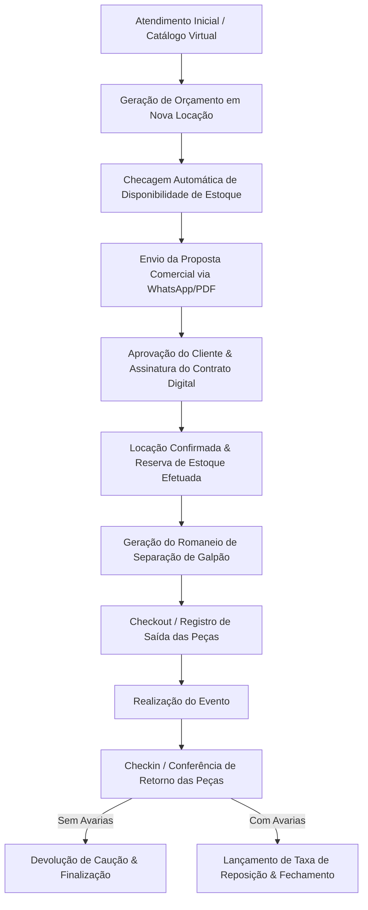

# 👑 SISTEMA CELEBRE — MANUAL TÉCNICO & RESUMO DETALHADO DO SISTEMA

> **Celebre - Sistema Especializado em Gestão de Festas, Eventos e Locação de Acervo**  
> *Documento técnico e operacional definitivo cobrindo 100% dos módulos, páginas, abas, fluxos e componentes do sistema.*

---

## 📑 SUMÁRIO EXECUTIVO

1. [Visão Geral e Arquitetura Tecnológica](#1-visão-geral-e-arquitetura-tecnológica)
2. [Modelagem de Dados & Coleções Firestore](#2-modelagem-de-dados--coleções-firestore)
3. [Navegação e Layout Base](#3-navegação-e-layout-base)
4. [Detalhamento de Módulos e Páginas](#4-detalhamento-de-módulos-e-páginas)
   - [4.1 Dashboard Principal (`/dashboard`)](#41-dashboard-principal-dashboard)
   - [4.2 Gestão de Locações (`/locacoes`)](#42-gestão-de-locações-locacoes)
   - [4.3 Gestão de Clientes (`/clientes`)](#43-gestão-de-clientes-clientes)
   - [4.4 Estoque e Acervo (`/estoque`)](#44-estoque-e-acervo-estoque)
   - [4.5 Financeiro & Fluxo de Caixa (`/financeiro`)](#45-financeiro--fluxo-de-caixa-financeiro)
   - [4.6 Compras e Reposições (`/compras`)](#46-compras-e-reposições-compras)
   - [4.7 Fornecedores (`/fornecedores`)](#47-fornecedores-fornecedores)
   - [4.8 Agenda de Eventos (`/agenda`)](#48-agenda-de-eventos-agenda)
   - [4.9 Logística & Carregamento (`/logistica`)](#49-logística--carregamento-logistica)
   - [4.10 Contratos Digitais & Assinatura (`/contratos`)](#410-contratos-digitais--assinatura-contratos)
   - [4.11 Moodboard & Projetos Visuais (`/moodboard`)](#411-moodboard--projetos-visuais-moodboard)
   - [4.12 Catálogo Virtual & Vitrine (`/catalogo`)](#412-catálogo-virtual--vitrine-catalogo)
   - [4.13 Relatórios & Inteligência de Negócio (`/relatorios`)](#413-relatórios--inteligência-de-negócio-relatorios)
   - [4.14 Configurações do Sistema (`/configuracoes`)](#414-configurações-do-sistema-configuracoes)
   - [4.15 Central de Notificações (`/notificacoes`)](#415-central-de-notificações-notificacoes)
   - [4.16 Equipe & Controle ASO (`/Usuarios`)](#416-equipe--controle-aso-usuarios)
   - [4.17 Planos, Assinaturas & Painel Admin (`/planos` / `/admin`)](#417-planos-assinaturas--painel-admin-planos--admin)
5. [Workflows Operacionais Integrados](#5-workflows-operacionais-integrados)
6. [Regramento de Blindagem de Layout & UI/UX](#6-regramento-de-blindagem-de-layout--uiux)

---

## 1. VISÃO GERAL E ARQUITETURA TECNOLÓGICA

O **Sistema Celebre** foi desenvolvido para resolver as dores operacionais diárias de decoradoras de festas, galpões de locação de acervos e empresas do segmento "Pegue e Monte".

### 🛠️ Stack Tecnológica:
- **Core Frontend**: React 18+ impulsionado por **Vite** para compilação ultrarrápida.
- **Roteamento**: `react-router-dom` v6 com rotas dinâmicas, controle de estado de navegação e guardas de segurança.
- **Backend as a Service (BaaS)**: **Firebase**
  - *Firestore Database*: Banco de dados NoSQL em tempo real.
  - *Firebase Authentication*: Autenticação via e-mail/senha.
  - *Firebase Storage*: Armazenamento de imagens de produtos, fotos de avarias, comprovantes e contratos.
- **Visualização de Dados**: `recharts` (Gráficos de Área, Barras e Donut responsivos).
- **Estilização**: Vanilla CSS 3 modularizado com CSS Variables (Design System Enterprise com suporte nativo a responsividade mobile e dark/light tokens).
- **Geração de Documentos**: HTML5 Canvas e utilitários para impressão térmica e exportação em PDF.

### 🛡️ Arquitetura de Segurança & Multitenancy:
- **Isolamento de Dados (Multitenancy)**: Todos os documentos gravados nas coleções contêm a chave `tenantId`. Consultas Firestore utilizam obrigatoriamente `where('tenantId', '==', tenantId)`, garantindo isolamento total entre diferentes empresas.
- **Guardiões de Rota (`App.jsx`)**:
  - `RotaPrivada`: Exige autenticação de usuário ativo.
  - `RotaAdmin`: Restringe acesso a funções exclusivas do Super Admin.
  - `TravaSeguranca`: Componente de validação dupla que checa permissões por módulo (`Financeiro`, `Relatorios`, `Equipe`) para perfis de funcionários.

---

## 2. MODELAGEM DE DADOS & COLEÇÕES FIRESTORE

O sistema opera sobre um ecossistema NoSQL organizado nas seguintes coleções principais:

1. `locacoes`: Armazena dados de contratos, orçamentos, cliente associado, intervalo de datas (retirada, evento, devolução), tipo de serviço (Pegue e Monte vs. Decoração), lista de itens locados, valores (frete, desconto, sinal, caução, total), status e controle de devolução/avarias.
2. `clientes`: Registro de clientes com nome, CPF/CNPJ, WhatsApp, e-mail, endereço completo com CEP e notas de relacionamento.
3. `estoque`: Catálogo do acervo. Guarda SKU, nome, categoria, quantidade total, quantidade disponível, valor de locação, valor de reposição, dimensões, cor, estado e galeria de fotos.
4. `financeiro`: Registros de entradas (locações, vendas) e saídas (aluguel do galpão, pessoal, manutenção, compras), data de vencimento, data de pagamento, categoria e anexo.
5. `compras`: Aquisições de peças de acervo e insumos (balões, fitas, embalagens) com vinculação a fornecedores e rastreio de prazos de entrega.
6. `fornecedores`: Parceiros comerciais, e-commerces (Mercado Livre, Shopee), artesãos, marceneiros e freteiros.
7. `contratos`: Minutas de contratos e instâncias de contratos assinados digitalmente.
8. `equipe`: Cadastro de colaboradores da empresa, seus cargos e mapa de permissões granulares por módulo.
9. `configuracoes`: Parâmetros da empresa (logo, chave PIX, endereço, margem de bloqueio de estoque).
10. `notificacoes`: Alertas do sistema referentes a atrasos e tarefas do dia.

---

## 3. NAVEGAÇÃO E LAYOUT BASE

O layout é composto por três estruturas globais:

- **`Navbar.jsx` (Menu Lateral / Drawer Mobile)**:
  - Navegação expansível com ícones para todos os módulos.
  - Exibição do plano ativo da empresa.
  - Badges de notificações em tempo real.
- **`Topbar.jsx` (Barra Superior)**:
  - Identificação da empresa e do usuário logado.
  - Atalho rápido de busca e central de notificações (`SininhoNotificacoes.jsx`).
  - Botão de logout seguro.
- **`SininhoNotificacoes.jsx`**:
  - Popover inteligente com alertas de locações a saírem hoje, devoluções vencendo ou atrasadas.

---

## 4. DETALHAMENTO DE MÓDULOS E PÁGINAS

---

### 4.1 Dashboard Principal (`/dashboard`)
Página central de inteligência e controle de fluxo do negócio.
- **Cards KPI**: Total de locações ativas, faturamento do mês, devoluções pendentes e itens em manutenção.
- **Próximos Eventos & Saídas**: Lista cronológica de retiradas e entregas programadas.
- **Gráficos de Desempenho**: Faturamento por período e itens mais locados do acervo.

---

### 4.2 Gestão de Locações (`/locacoes`)
- **Lista de Locações (`Locacoes.jsx`)**:
  - Tabela responsiva com busca por cliente, número de contrato, intervalo de datas e status.
  - Filtro por abas de status: *Orçamentos*, *Confirmados*, *Em Separação*, *Entregues*, *Concluídos*, *Cancelados*.
  - Ações em massa e atalhos de alteração de status.
- **Nova Locação / Edição (`NovaLocacao.jsx`)**:
  - Simulador de disponibilidade em tempo real por intervalo de datas.
  - Seleção visual de acervos com leitor de SKU e filtros de categoria.
  - Cálculo automático de frete, desconto, valor de sinal e caução.
- **Visualizador de Contrato (`VisualizarLocacao.jsx`)**:
  - Emissão de contrato com minuta dinâmica, espelho do pedido e botão para envio via WhatsApp ou PDF.
- **Romaneio & Expedição (`RomaneioModal.jsx`)**:
  - Lista de separação de peças para equipe de galpão com caixas de checagem.

---

### 4.3 Gestão de Clientes (`/clientes`)
- **Painel de Clientes (`Clientes.jsx`)**:
  - Lista completa de clientes cadastrados com estatísticas de locação.
- **Novo Cliente / Edição (`NovoCliente.jsx`)**:
  - Formulário completo com consulta de CEP automática, CPF/CNPJ, WhatsApp formatado e campo de observações comportamentais.

---

### 4.4 Estoque e Acervo (`/estoque`)
- **Catálogo de Estoque (`Estoque.jsx`)**:
  - Visualização em Grid de Cards ou Tabela com foto, SKU, categoria, peças totais, disponíveis e quebradas.
  - Filtro por disponibilidade em data específica.
- **Cadastro de Item (`CadastroEstoque.jsx`)**:
  - Upload de fotos para o Firebase Storage.
  - Cadastro de SKU, dimensões, cor, valor de locação e valor de reposição (para cobrança de avarias).
  - Definição de formato: *Peça Avulsa* vs *Kit / Conjunto*.

---

### 4.5 Financeiro & Fluxo de Caixa (`/financeiro`)
- **Fluxo Financeiro (`Financeiro.jsx`)**:
  - Lançamentos de receitas e despesas por categoria.
  - DRE Operacional, controle de formas de pagamento (PIX, Cartão, Dinheiro).
  - Controle de Cauções retidas e devolvidas aos clientes.

---

### 4.6 Compras e Reposições (`/compras`)
- **Gestão de Compras (`Compras.jsx`)**:
  - Registro de compras de reposição de acervo avariado, investimento em novos temas e aquisição de descartáveis/insumos.
  - Exportação e envio de lista de compras para WhatsApp ou PDF.
  - Filtros avançados por canal (*Online* vs *Presencial*), fornecedor e status.
- **Nova Compra com Redesign SaaS Premium (`NovaCompra.jsx`)**:
  - **Dark Hero Header**: Identidade visual escura com gradiente dourado (`#0f172a` a `#1e293b`).
  - **Stepper Workflow**: 3 passos lógicos (*1. Para quem?*, *2. O que será comprado?*, *3. Onde e como comprar?*).
  - **Layout Reordenado**: Pergunta *"Para quem é esta compra?"* no início, permitindo alternar entre *Reposição de Acervo* (Estoque Geral) e *Pedido Específico* (Vínculo dinâmico com evento do cliente e validação automática de prazo de entrega).
  - **Campos Financeiros Lado a Lado (2 Colunas)**: `Custo Unitário (R$)` e `Aluguel (R$)` organizados em 2 colunas horizontais limpas (`.nc-grid-2`).
  - **Modal de Fornecedores Cadastrados & Atalhos Rápidos**: Botão *"🔍 Buscar Cadastrado"* abre modal com pesquisa inteligente e seção de atalhos rápidos para plataformas (*Mercado Livre*, *Shopee*, *Festas e Chocolate*, *Armarinho Fernando*).
  - **Layout Responsivo Blindado**: Classe `.nc-grid-logistica` ajusta a seção de frete e condição para 1 coluna no celular, evitando overflow horizontal e mantendo os campos financeiros em 2 colunas em qualquer dispositivo.

---

### 4.7 Fornecedores (`/fornecedores`)
- **Painel de Fornecedores (`Fornecedores.jsx`)**:
  - Cadastro de parceiros, e-commerces, marceneiros, pintores, freteiros e lojas de insumos.
- **Novo Fornecedor (`NovoFornecedor.jsx`)**:
  - Formulário com razão social, contato do vendedor, WhatsApp, chave PIX e categoria de fornecimento.

---

### 4.8 Agenda de Eventos (`/agenda`)
- **Calendário da Decora (`Agenda.jsx`)**:
  - Calendário interativo com modos Mês, Semana e Dia.
  - Marcadores coloridos diferenciando:
    - 🚚 *Data de Retirada/Entrega*
    - 🎉 *Data da Festa/Evento*
    - 📦 *Data de Devolução/Recolhe*

---

### 4.9 Logística & Carregamento (`/logistica`)
- **Painel Logístico (`Logistica.jsx`)**:
  - Organização diária das rotas de entrega e recolhimento.
  - Atribuição de motorista e veículos.
  - Emissão da Lista de Carregamento do Caminhão.

---

### 4.10 Contratos Digitais & Assinatura (`/contratos`)
- **Gerenciador de Contratos (`Contratos.jsx`)**:
  - Painel de contratos gerados, assinados e pendentes.
- **Assinatura Digital (`AssinaturaContrato.jsx`)**:
  - Interface para o cliente assinar o contrato digitalmente pelo celular.

---

### 4.11 Moodboard & Projetos Visuais (`/moodboard`)
- **Mural Criativo (`Moodboard.jsx`)**:
  - Tela interativa estilo "canvas" para combinar peças do acervo, móveis e arranjos visuais antes do evento.

---

### 4.12 Catálogo Virtual & Vitrine (`/catalogo`)
- **Vitrine Virtual (`Catalago.jsx`)**:
  - Galeria de acervos e temas prontos organizada para enviar a clientes via WhatsApp.

---

### 4.13 Relatórios & Inteligência de Negócio (`/relatorios`)
Dividido em 4 abas analíticas avançadas:
1. **Pedidos (`PedidosTab.jsx`)**: Taxa de conversão e ticket médio.
2. **Estoque (`EstoqueTab.jsx`)**: Curva ABC e peças ociosas.
3. **Financeiro (`FinanceiroTab.jsx`)**: DRE e inadimplência.
4. **Clientes (`ClientesTab.jsx`)**: Recompra e ranking de clientes.

---

### 4.14 Configurações do Sistema (`/configuracoes`)
- Gestão de dados da empresa, chave PIX, logomarca, permissões de equipe, margem de bloqueio de estoque e cópia de segurança (Backup).

---

### 4.15 Central de Notificações (`/notificacoes`)
- Alertas em tempo real sobre devoluções pendentes, cobranças e tarefas logísticas do dia.

---

### 4.16 Equipe & Controle ASO (`/Usuarios`)
- Gerenciamento de acessos da equipe de galpão e atendimento, logs de auditoria e controle de ASO.

---

### 4.17 Planos, Assinaturas & Painel Admin (`/planos` / `/admin`)
- Painel de planos SaaS do Celebre e controle geral de tenants para o Super Admin.

---

## 5. WORKFLOWS OPERACIONAIS INTEGRADOS

---

## 7. RESUMO EXECUTIVO DE ATUALIZAÇÕES & MODERNIZAÇÕES RECENTES

### 7.1. Página de Financeiro (`Financeiro.jsx` & `Financeiro.css`)
- **Remoção do Container Azul Pesado**: Eliminado o antigo container escuro redundante que repetia métricas numéricas.
- **Card KPI 4 Enriquecido**: Subtexto dinâmico adicionado no card `SALDO LÍQUIDO REAL` (`Est. Fim Mês: R$ ...`).
- **Novo Widget de Distribuição por Categoria**: Rosca Donut + Barras de Progresso de Categoria substituindo texto bruto sem formatação.
- **Exportador Excel / CSV**: Botão **`📥 Exportar (.CSV)`** para download dos dados financeiros direto para planilhas.

### 7.2. Central de Relatórios Estratégicos & DRE (`Relatorios.jsx` & Sub-abas)
- **Header Executivo**: Badge dourado `📊 CENTRAL DE INTELIGÊNCIA & DRE` com pílulas de navegação responsivas.
- **Aba 💰 Financeiro & DRE**:
  - DRE com Livro Caixa em tempo real, 4 Cards KPI protegidos pelas Regras de Ouro.
  - Card de Insight de Saúde Financeira dinâmico com cálculo de margem real e alertas inteligentes (`🟢 SAUDÁVEL`, `🟡 MARGEM COMPRIMIDA`, `🚨 DÉFICIT OPERACIONAL`).
  - Barra de Balanço Proporcional de Entradas vs Saídas ultra-compacta com histórico de chips mensais.
  - Exportação de DRE em PDF assinado com logotipo, CNPJ e data/hora auditada.
- **Aba 👥 Clientes & CRM**:
  - Indicadores de LTV, Ticket Médio, Taxa de Fidelidade e Clientes Recorrentes.
  - Painel de Insight com destaque para o cliente de maior LTV e cidade líder em eventos.
  - Ranking compacto dos Top 3 Clientes VIP e Cidades com mais festas.
- **Aba 📦 Estoque & ROI**:
  - Valoração de acervo físico total, cálculo de variedades de tipos e peças em manutenção.
  - Insight de disponibilidade física e saúde do acervo.
  - Composição por categorias e temas campeões em locação.
- **Aba 📑 Pedidos & Vendas**:
  - Mapeamento de volume contratado, taxa de conversão comercial de orçamentos e festas futuras no radar.
  - Filtros por modalidade (Decoração Completa vs Pegue e Monte) e exportação comercial de pedidos em PDF.

### 7.3. Auditoria de Segurança e Desempenho
- **Blindagem de Grids KPI**: Garantia rigorosa das Regras de Ouro 1 (1 linha no Desktop) e 2 (2 colunas no Celular).
- **Sem Overflow nem Poluição Visual**: Otimização vertical de cards para evitar rolagem excessiva e manter todas as informações visíveis na tela.

---

*Manual técnico e Resumo Executivo gerados e atualizados para o repositório Celebre.*

