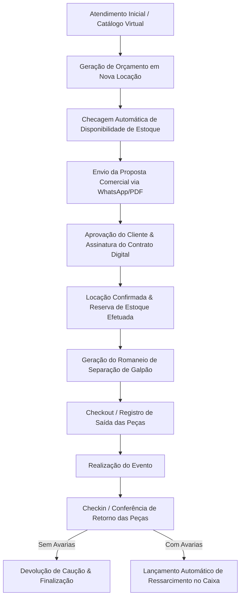

# 🏆 RESUMO EXECUTIVO DO SISTEMA — CELEBRE FESTAS & DECORAÇÕES

> **Plataforma SaaS Multi-Tenant Especializada em Gestão de Locação de Acervo, Decoração e Pegue & Monte**  
> *Documento Executivo e Técnico Definitivo cobrindo Arquitetura, Módulos, Segurança, Workflows Operacionais, Blindagem de UI/UX e Histórico de Evolução.*  
> **Tecnologias**: React 19 / 18 + Vite 7 · Firebase Firestore & Auth · Mercado Pago SDK · Vanilla CSS Luxury Design System (`#c5a059`, Glassmorphism, Dark/Light Mode)  
> **Data de Referência**: Agosto / 2026  

---

## 📑 SUMÁRIO EXECUTIVO

1. [Visão Geral e Propósito do Negócio](#1-visão-geral-e-propósito-do-negócio)
2. [Arquitetura Tecnológica e Stack Executiva](#2-arquitetura-tecnológica-e-stack-executiva)
3. [Modelo de Segurança, RBAC & Multitenancy](#3-modelo-de-segurança-rbac--multitenancy)
4. [Modelagem de Dados & Coleções Firestore](#4-modelagem-de-dados--coleções-firestore)
5. [Workflow Operacional Integrado](#5-workflow-operacional-integrado)
6. [Detalhamento Completo dos Módulos do Sistema](#6-detalhamento-completo-dos-módulos-do-sistema)
7. [Regramento e Blindagem de Layout (Compliance AGENTS.md)](#7-regramento-e-blindagem-de-layout-compliance-agentsmd)
8. [Diferenciais Competitivos e Valor Agregado](#8-diferenciais-competitivos-e-valor-agregado)
9. [Histórico de Sessões de Desenvolvimento](#9-histórico-de-sessões-de-desenvolvimento)
10. [Roadmap Estratégico e Próximos Passos](#10-roadmap-estratégico-e-próximos-passos)

---

## 🎯 1. VISÃO GERAL E PROPÓSITO DO NEGÓCIO

O **Celebre Festas & Decorações** é uma plataforma SaaS (Software as a Service) de alta performance desenvolvida sob medida para atender acervos de festas, decoradores, galpões de locação e empresas no modelo **Pegue e Monte** ou **Eventos Completos**.

O sistema centraliza e otimiza todo o ciclo operacional de uma locadora:
- **Prospecção & Vitrine Digital**: Disponibilização de catálogo online interativo com auto-cadastro de clientes e envio de propostas comerciais via WhatsApp.
- **Prevenção Total de Overbooking**: Algoritmo inteligente de checagem de disponibilidade de acervo cruzando reservas por intervalo de datas (retirada, evento e devolução).
- **Gestão de Galpão & Expedição**: Emissão de romaneio de separação, conferência com leitor de código de barras/QR e registro visual de avarias com fotos.
- **Fechamento Comercial Acelerado**: Contratos com assinatura digital na tela do celular (Touch/Mouse) com validade e geração de PDF.
- **Controle Financeiro & Suprimentos**: Módulo de caixa, emissão de DRE, contas fixas recorrentes, gestão de fornecedores e ordens de compras integradas.

---

## 📦 2. ARQUITETURA TECNOLÓGICA E STACK EXECUTIVA

```
[ Frontend: React 19/18 + Vite 7 ] ──► [ React Router v7/v6 ] ──► [ Vanilla CSS Luxury System ]
                                            │
                                            ▼
                         [ BaaS: Firebase (Firestore, Auth, Storage) ]
                                            │
                                            ▼
                       [ Multitenancy: Isolamento por tenantId ]
```

| Camada | Tecnologia & Padrões | Descrição / Papel no Sistema |
|---|---|---|
| **Core Frontend** | React 19 / 18 + Vite 7 | Single Page Application (SPA) ultra-rápida com suporte a temas dinâmicos e build em ~12s |
| **Backend (BaaS)** | Firebase Firestore | Banco NoSQL em tempo real blindado por regras de segurança e isolamento por `tenantId` |
| **Autenticação** | Firebase Auth | Autenticação por E-mail/Senha com controle de sessões e hierarquia de acesso |
| **Mídia & Arquivos** | Firebase Storage | Armazenamento de fotos de produtos, fotos de avarias, comprovantes Pix e contratos |
| **Pagamentos & Pix** | Mercado Pago SDK + Pix | Gateway multi-tenant permitindo integração direta da conta bancária da locadora |
| **Assinatura Digital** | React Signature Canvas | Coleta de assinatura digital na tela (Touch/Mouse) vinculada ao contrato |
| **Relatórios & PDF** | jsPDF + AutoTable + Recharts | Emissão de comprovantes, romaneios, DRE gerencial e mapas de separação em PDF |
| **Estilização** | Vanilla CSS Luxury Design System | Paleta sofisticada Dourado Celebre (`#c5a059`), Glassmorphism, Light e Dark Modes |
| **Auditoria & Logs** | Firestore Audit Ledger | Registro centralizado (`logs_atividades`) para rastreamento de ações críticas e equipe |

---

## 🛡️ 3. MODELO DE SEGURANÇA, RBAC & MULTITENANCY

- **Isolamento Multi-Tenant Estrito**: Cada empresa possui um workspace 100% isolado. Todos os registros (clientes, peças, locações, lançamentos, compras) carregam o identificador obrigatorio `tenantId`. Consultas Firestore utilizam `where('tenantId', '==', tenantId)`.
- **Trava de Segurança em Tempo Real (`TravaSeguranca.jsx`)**:
  1. **Validação de Plano / Trial**: Checa se a empresa possui assinatura ativa ou se está no período de avaliação de 7 dias. Bloqueia acessos indevidos caso o plano expirante não seja renovado.
  2. **Permissões Granulares de Funcionários**: Restringe rotas sensíveis com base nos privilégios concedidos ao usuário da equipe (ex.: bloqueia Financeiro, Relatórios e Usuários para perfis operacionais).
- **Super Admin (`celebrefesta25@gmail.com`)**: Painel administrativo master (`/admin`) para acompanhamento global de empresas cadastradas, status de pagamentos e liberação de recursos.

---

## 🗂️ 4. MODELAGEM DE DADOS & COLEÇÕES FIRESTORE

O sistema opera sobre um ecossistema NoSQL organizado nas seguintes coleções principais:

1. **`locacoes`**: Dados de contratos, orçamentos, cliente atrelado, intervalo de datas (retirada, evento, devolução), modalidade (Pegue e Monte vs Decoração Completa), lista de peças locadas, valores (frete, desconto, sinal, caução, total), status e controle de devolução/avarias.
2. **`estoque`**: Catálogo de acervo com SKU, nome, categoria, quantidade total, disponível, quebrada/em manutenção, valor de locação, valor de reposição, dimensões, cor, estado e galeria de fotos.
3. **`clientes`**: Registro de clientes com nome, CPF/CNPJ, WhatsApp, e-mail, endereço completo com busca por CEP (ViaCEP) e histórico de locações.
4. **`financeiro`**: Registros de entradas (locações, vendas) e saídas (aluguel de galpão, pessoal, manutenção, compras), data de vencimento, pagamento, categoria, forma de pagamento e anexo de comprovante.
5. **`financeiro_recorrentes`**: Cadastro de despesas fixas e salários mensais recorrentes com lançamento automático em 1-click no caixa real.
6. **`compras`**: Aquisições de peças de acervo e insumos com vinculação a fornecedores, modalidade (Online vs Presencial) e rastreio de prazos de entrega (Mercado Livre Full, Sedex, Shopee, Compras Locais).
7. **`fornecedores`**: Cadastro de parceiros comerciais, e-commerces, marceneiros, pintores e freteiros.
8. **`contratos`**: Minutas de contratos e instâncias de contratos assinados digitalmente.
9. **`equipe` / `logs_atividades`**: Colaboradores, permissões por módulo e auditoria completa de ações.
10. **`configuracoes`**: Parâmetros da empresa (logomarca, chave PIX, token Mercado Pago, margem de bloqueio).
11. **`notificacoes`**: Alertas em tempo real sobre saídas do dia, devoluções pendentes e cobranças.

---

## 🔄 5. WORKFLOW OPERACIONAL INTEGRADO



---

## 🧩 6. DETALHAMENTO COMPLETO DOS MÓDULOS DO SISTEMA

### 🔐 6.1. Vitrine Comercial & Autenticação (`/src/pages/Auth/`, `/LandingPage/`)
- **Landing Page Comercial (`/`)**: Apresentação dos recursos do sistema, planos e formulário de conversão.
- **Login e Cadastro (`/login`, `/cadastro`)**: Registro instantâneo de novas empresas com provisionamento automático de tenant.
- **Recuperação de Acesso (`/redefinir-senha`, `/confirmar-email`)**: Fluxo seguro de gestão de credenciais via Firebase Auth.
- **Catálogo Digital Público (`/catalogo/:idEmpresa`)**: Vitrine online onde os clientes finais da locadora podem navegar pelas peças e temas da empresa.
- **Auto-Cadastro de Clientes (`/autocadastro/:idEmpresa`)**: Link compartilhável para preenchimento cadastral direto pelo cliente.

---

### 📊 6.2. Dashboard & Auditoria de Estoque (`/src/pages/Dashboard/`)
- **Painel Gerencial (`Dashboard.jsx`)**: KPIs em tempo real (Faturamento mensal, ticket médio, locações ativas, entregas pendentes), aniversariantes do mês e gráficos interativos.
- **Auditoria de Estoque (`AuditoriaEstoque.jsx`)**: Raio-X operacional do acervo (peças alugadas em trânsito, devoluções pendentes, itens em higienização e avarias registradas).

---

### 👥 6.3. Gestão de Clientes (`/src/pages/Clientes/`)
- **Cadastro Completo (`Clientes.jsx`, `CadastroCliente.jsx`)**: Dados pessoais/jurídicos, busca de CEP automática (ViaCEP), contato e notas comportamentais.
- **Histórico de Locações**: Visualização rápida de todos os contratos e orçamentos atrelados ao cliente.
- **Integração WhatsApp**: Envio direto de mensagens formatadas, propostas e links de cobrança em 1 clique.

---

### 📦 6.4. Controle de Acervo, Estoque & Manutenção (`/src/pages/Estoque/`)
- **Gestão de Peças e Kits (`Estoque.jsx`, `CadastroEstoque.jsx`)**:
  - Organização por categorias, SKU automático, valor de locação, valor de reposição e estado de conservação.
  - Upload de imagens para o Firebase Storage.
- **Cálculo de Disponibilidade Inteligente**:
  - Algoritmo que cruza o período desejado com as locações confirmadas, desconsiderando pedidos cancelados para evitar overbooking.
- **Módulo Avançado de Manutenção & Rastreabilidade de Kit/Decoração**:
  - **Validação de Conflito Manutenção x Locação**: Rastreia se peças avulsas ou **peças embutidas em receitas de Kits e Decorações Completas** possuem reservas ativas no período do conserto.
  - **Bloqueio e Ajuste Automático de Segurança**: Alerta se a manutenção deixar o estoque livre zerado, oferecendo limitar o reparo à quantidade livre segura.
  - **Ação em Lote de Manutenção**: Botão `✅ Concluir Reparo dos Selecionados` na barra de seleção em massa para liberar múltiplas peças reformadas de uma só vez.
  - **Insígnia de Conflito**: Tarja vermelha na tabela de acervo identificando o pedido e cliente afetados pelo atraso do reparo.

---

### 📑 6.5. Locações, Orçamentos e Matriz de Disponibilidade (`/src/pages/Locacoes/`)
- **Nova Locação / Editar (`NovaLocacao.jsx`, `EditarLocacao.jsx`)**:
  - **Modalidade Pegue e Monte vs Decoração Completa**: Seleção rápida que ajusta regras operacionais e taxas de frete/entregas.
  - **Desconto Flexível**: Alternância entre valor em Reais (**`R$`**) e Porcentagem (**`%`**).
  - **Catálogo Modal Luxury**: Modal visual estilo e-commerce para inclusão de peças ao pedido com 1 clique.
- **Matriz de Disponibilidade & Timeline Gantt (`ModalCalendarioDisponibilidade.jsx`)**:
  - **Visão Quinzena no Mobile**: Divisão do mês em 1ª Quinzena (1-15) e 2ª Quinzena (16-fim), dobrando a largura útil de toque no celular.
  - **Seletor Compacto de Reservas (`📌 RESERVAS (X)`)**: Dropdown que agrupa clientes e pedidos do mês sob o card da peça sem poluir a tela.
  - **Navegação Direta 1-Click**: Botão `🔗 Abrir Pedido ➔` para saltar direto para a edição da locação.
  - **Filtro de Reforma & Substitutos**: Atalho `🛠️ Filtrar Peças em Reforma` e sugestão de substitutos da mesma categoria no dia do conflito.
- **Alertas Operacionais & Checklist de Galpão (`ModalRomaneioSeparacao.jsx` & `CheckoutPage.jsx`)**:
  - Alerta vermelho de emergência (`🚨 REPARO PENDENTE!`) na tabela de locações.
  - Impressão de Romaneio de Separação em formato A4/Térmico e checklist interativo com conferência por fotos.
  - **Ressarcimento Automático no Checkout**: Lançamento automático de avarias/faltas no módulo financeiro.

---

### 📝 6.6. Contratos e Assinatura Digital (`/src/pages/Contratos/`)
- **Modelos Customizáveis (`ModelosContrato.jsx`)**: Criação de cláusulas padronizadas e termos de responsabilidade.
- **Geração e Assinatura (`NovoContrato.jsx`, `AssinaturaContrato.jsx`)**: Vinculação automática dos dados da locação e coleta de assinatura digital na tela com armazenamento no sistema e emissão em PDF.

---

### 💵 6.7. Gestão Financeira, Comprovantes & Contas Fixas (`/src/pages/Financeiro/`)
- **Arquitetura Unificada de 3 Abas (`Financeiro.jsx`, `Financeiro.css`)**:
  - **Aba 1: 📊 Fluxo de Caixa**: 4 Cards KPI protegidos, barrinha de resumo por forma de pagamento (`⚡ Pix`, `💳 Cartão`, `💵 Dinheiro`, `📄 Boleto`), gráfico Donut de categorias e exportador CSV.
  - **Aba 2: 📎 Comprovantes Recebidos**: Central de auditoria para upload, ampliação em HD e download de comprovantes Pix anexados às locações.
  - **Aba 3: 🏢 Contas Fixas & Despesas Recorrentes**: Controle de salários e despesas de infraestrutura. Inclui **Modal Celebre VIP** renderizado no `document.body` via React Portal com `backdrop-filter: blur(14px)` e botão `⚡ Lançar no Caixa`.

---

### 🛒 6.8. Compras, Aquisições & Nova Compra Redesign (`/src/pages/Compras/`, `/Fornecedores/`)
- **Módulo Nova Compra (`NovaCompra.jsx`)**:
  - Dark Hero Header com gradiente dourado (`#0f172a` a `#1e293b`).
  - Stepper Workflow em 3 passos: `🎯 Para quem é esta compra?` (Reposição vs Evento Específico), `📦 O que será comprado?` e `🚚 Onde e como comprar?`.
  - Modal de fornecedores com atalhos rápidos para marketplaces (*Mercado Livre*, *Shopee*).
- **Gestão de Ordens de Compra (`Compras.jsx`)**:
  - **Ordenação Inteligente**: Mova automaticamente os itens concluídos (`No Acervo`) para o **rodapé da tabela** com opacidade reduzida (`opacity: 0.45`), texto riscado e fundo discreto.
  - Cards KPI e Abas estilizados com gradientes pastéis e sombras 3D elevadas.

---

### 🚚 6.9. Logística, Roteiro de Galpão & Vistoria de Campo (`/src/pages/Logistica/`, `/Agenda/`)
- **Agenda de Eventos (`Agenda.jsx`)**: Calendário interativo (Mês, Semana, Dia) diferenciando saídas (🚚), eventos (🎉) e recolhes (📦).
- **Esteira Operacional de Galpão em 4 Etapas (`Logistica.jsx`, `Logistica.css`)**:
  - `1. A Separar`: Pedidos confirmados e aprovados aguardando início da conferência de saída.
  - `2. Em Separação`: Separação ativa no acervo com checklist de conferência e bipagem de código de barras.
  - `3. Na Rua / Evento`: Pedidos em trânsito, montagem ou durante o evento do cliente.
  - `4. Devolvidos`: Retorno ao galpão para vistoria de devolução, baixa definitiva no estoque e lançamento de avarias.
- **Sistema de Vistoria de Devolução & Saída (`ModalCheckinLocacao.jsx`, `ModalCheckinLocacao.css`)**:
  - Layout flutuante luxury com suporte a 2 colunas no Desktop (980px) e card responsivo no celular (`border-radius: 16px`).
  - Steppers de conferência fracionada `[-] 0 [+] [Max]` para cada peça e botões de status (`🟢 OK`, `🛠️ Avaria`, `❌ Falta`).
  - Câmera ao vivo para leitura instantânea de QR Code e Código de Barras dos caixotes/peças.
  - Máscara monetária BRL automática em tempo real para registro de custos de reparo/avaria.
  - Integração financeira automática com lançamento de cobrança de avarias no Caixa do Financeiro.
  - Anexo de fotos de vistoria e Canvas de Assinatura Digital Touch (`touch-action: none`) sem rolagem acidental.
- **Gestão de Transporte, Motorista & Embalagens Retornáveis (`ModalDesignarMotorista.jsx`)**:
  - Atribuição rápida de motorista/equipe e veículo designado.
  - Controle e contagem de embalagens retornáveis de galpão (Caixas Plásticas, Sacolas e Capas de Painel).
  - Campo de instruções de rota para motorista com impressão direta na Folha de Campo.
- **Ecossistema de Documentos & Relatórios em PDF da Logística**:
  - `gerarRomaneioPDF.js`: Romaneio de Carga & Rota do Motorista com resumo de entregas, coletas e saldo a receber.
  - `gerarFolhaSeparacaoGalpaoPDF.js`: Mapa Geral de Separação de Peças consolidado por período.
  - `gerarComprovanteCheckinPDF.js`: Comprovante oficial de vistoria e conferência de devolução/saída com dados do responsável e assinatura.
  - `gerarEtiquetasCaixotePDF.js`: Etiquetas de expedição para colar nos caixotes antes da saída do galpão.
- **Ações Inteligentes e Contextuais por Etapa**:
  - `Na Rua`: Exibe atalhos de `📍 Rota GPS` e `✍️ Assinar Entrega`.
  - `Expedição / Saída`: Exibe `🏷️ Etiqueta PDF` e `🚚 Transporte & Carga`.
  - `Devolvidos`: Exibe `📄 Vistoria PDF` e remove atalhos de GPS/etiquetas desnecessários.
- **Destravamento e Regularização em Lote de Pedidos Atrasados**:
  - Botão `⚡ Destravar Atrasados` para mover em 1-clique pedidos retroativos para a etapa de Devolvidos.

---

### 🎨 6.10. Moodboard & Projetos Visuais (`/src/pages/Moodboard/`)
- **Criador Visual (`Moodboard.jsx`)**: Canvas interativo para composição de paletas de cores, cenários e arranjos visuais para propostas de locação.

---

### 🛍️ 6.11. Catálogo Virtual & Vitrine (`/src/pages/Catalago/`)
- **Vitrine Virtual Público (`Catalago.jsx`)**: Galeria dinâmica com foto principal e visualização de itens inclusos em cenários completos, pronta para envio de orçamentos pelo WhatsApp.

---

### 📊 6.12. Relatórios & Inteligência de Negócio / DRE (`/src/pages/Relatorios/`)
- **Central de Inteligência**: 4 Abas analíticas avançadas:
  1. `Pedidos`: Taxa de conversão, ticket médio e volume contratado.
  2. `Estoque`: Curva ABC de locações, valoração de acervo físico e peças ociosas.
  3. `Financeiro / DRE`: DRE gerencial, livro caixa auditado e alertas margem (`🟢 SAUDÁVEL`, `🟡 COMPRIMIDA`, `🚨 DÉFICIT`).
  4. `Clientes`: Recompra, LTV e ranking de cidades.

---

### ⚙️ 6.13. Configurações & Personalização Multi-Tenant (`/src/pages/Configuracoes/`)
- **Perfil da Empresa (`AbaEmpresa.jsx`)**: Dados cadastrais, upload de logomarca e assinatura oficial.
- **Gateway & Chave PIX**: Mercado Pago Access Token próprio da empresa e chave PIX oficial.
- **Customização de Tema**: Modo Claro, Escuro (Midnight/Gray), contraste e cor primária (`--dourado`).

---

### 🔔 6.14. Central de Notificações (`/src/pages/Notificacoes/`)
- Alertas em tempo real referentes a saídas do dia, devoluções vencendo e tarefas logísticas.

---

### 👥 6.15. Equipe, Controle ASO & Monitoramento (`/src/Usuarios/`)
- **Controle de Usuários (`Usuarios.jsx`)**: Cadastro de colaboradores e atribuição de cargos.
- **Gestão ASO (`GestaoASO.jsx`)**: Controle de Atestados de Saúde Ocupacional da equipe.
- **Monitoramento (`Monitoramento.jsx`)**: Logs de auditoria operacional em tempo real.

---

### 💎 6.16. Planos, Assinaturas SaaS & Painel Admin (`/src/pages/Planos/`, `/Admin/`)
- **Matriz de Planos (`Planos.jsx`, `PaginaUpgrade.jsx`)**: Apresentação de planos (Teste, Starter, Pro, Enterprise) e upgrade.
- **Painel Admin Master (`ControleGeral.jsx`, `AdminPlanos.jsx`)**: Controle global de empresas, pagamentos e liberação de acessos.

---

## 🔒 7. REGRAMENTO E BLINDAGEM DE LAYOUT (COMPLIANCE AGENTS.MD)

O projeto possui regras de layout estritas e ativas para garantir estabilidade visual contínua em todos os dispositivos:

1. **Layout dos Cards KPI no Desktop (1 Única Linha)**:
   - A classe `.clientes-stats-grid` em **TODAS** as páginas (`Locacoes`, `Clientes`, `Estoque`, `Compras`, `Financeiro`) **DEVE PERMANECER OBRIGATORIAMENTE EM 1 SÓ LINHA HORIZONTAL (`flex-wrap: nowrap !important; display: flex !important;`)** no desktop (`> 900px`).
   - **NUNCA** permitir que os cards de KPI dobrem para 2 linhas no desktop. Todos os cards ajustam-se proporcionalmente lado a lado.
2. **Layout dos Cards KPI no Celular (2 Colunas)**:
   - A classe `.clientes-stats-grid` em **TODAS** as páginas **DEVE PERMANECER OBRIGATORIAMENTE EM 2 COLUNAS** no celular (`<= 900px`).
   - **NUNCA** alterar para `grid-template-columns: 1fr` em visualizações mobile. A regra utilizara `repeat(2, 1fr) !important`.
3. **Preservação de CSS e Estilos Visuais**:
   - Arquivos CSS (`Locacoes.css`, `Clientes.css`, `Estoque.css`, `Compras.css`, `ModalCalendarioDisponibilidade.css`) estão **BLINDADOS**.
   - Qualquer modificação de grid deve ser testada globalmente.

---

## 📈 8. DIFERENCIAIS COMPETITIVOS E VALOR AGREGADO

1. **Foco Total no Segmento de Festas**: Solução desenvolvida para resolver as dores reais do modelo *Pegue e Monte* e *Eventos Completos*.
2. **Autonomia Financeira Multi-Tenant**: Recebimento direto na conta bancária do cliente via integração nativa Mercado Pago ou Pix.
3. **Agilidade no Fechamento Comercial**: Catálogo digital, orçamento instantâneo, WhatsApp 1-click e assinatura digital de contratos.
4. **Segurança Operacional**: Prevenção de duplicidade de aluguel no acervo, controle de acesso de funcionários e rastreamento de peças em manutenção.

---

## 📅 9. HISTÓRICO DE SESSÕES DE DESENVOLVIMENTO

### 🗓️ Sessão: 15/08/2026 — 08h30 às 13h15 (BRT)
- ✅ **🚚 Reformulação Completa da Esteira Logística & Operação de Galpão (`Logistica.jsx`, `Logistica.css`)**:
  - Organização da esteira em **4 Etapas Operacionais Reais**: `1. A Separar`, `2. Em Separação`, `3. Na Rua / Evento`, `4. Devolvidos`.
  - Remoção da coluna de orçamentos da esteira para evitar separação precoce de propostas comerciais não fechadas.
  - Implementação do validador `verificarSeEhEntrega(loc)` com detecção de todos os formatos de frete.
  - Botão **`📦 Mapa de Separação (PDF)`** no topo consolidando todas as peças a separar para a equipe de galpão (`gerarFolhaSeparacaoGalpaoPDF.js`).
  - Botão **`📋 Romaneio da Rota (PDF)`** para o motorista com lista de entregas, coletas e saldo a receber (`gerarRomaneioPDF.js`).
  - Sincronização direta: clicar em `Receber ➔` na etapa "Na Rua" abre imediatamente o modal de Vistoria de Devolução.
- ✅ **💎 Modal de Vistoria de Devolução & Saída (`ModalCheckinLocacao.jsx`, `ModalCheckinLocacao.css`)**:
  - Modal flutuante luxury com bordas arredondadas (`border-radius: 16px`), margens e sombra.
  - Steppers fracionados `[-] 0 [+] [Max]`, botões de status (`🟢 OK`, `🛠️ Avaria`, `❌ Falta`), câmera de leitura de QR Code/Barcode ao vivo.
  - Máscara monetária BRL automática (`R$ 25,00`) e lançamento financeiro automático de avarias no Caixa.
  - Canvas de Assinatura Digital Touch (`touch-action: none`) e eliminação de caracteres corrompidos no PDF oficial (`gerarComprovanteCheckinPDF.js`).
- ✅ **🚗 Modal de Gestão de Transporte & Embalagens (`ModalDesignarMotorista.jsx`)**:
  - Designação de motorista/veículo, contagem de embalagens retornáveis (Caixas Plásticas, Sacolas, Capas) e instruções de rota.
- ✅ **Build de Produção Verificado**: `npm run build` aprovado com **0 erros** (`built in 11.57s - 12.78s`).

### 🗓️ Sessão: 11/08/2026 — 13h56 às 14h20 (BRT)
- ✅ **📱 Refatoração Definitiva da Responsividade Mobile (`Locacoes.jsx` & `Locacoes.css`)**:
  - Alinhamento dos botões `+ NOVA LOCAÇÃO` e `📅 DISPONIBILIDADE` em 2 colunas simétricas de 50%.
  - Igualdade rigorosa de altura nos cards KPI com CSS Grid (`align-items: stretch`) e `height: 100%`.
  - Chips operacionais compactos (`🚚 SAEM`, `📦 ENTRAM`, `⚠️ ATRASADOS`) encaixados em 3 colunas em qualquer celular.
- ✅ **Build de Produção Verificado**: `npm run build` aprovado com **0 erros** (`built in 15.38s`).

### 🗓️ Sessão: 11/08/2026 — 08h43 às 11h37 (BRT)
- ✅ **💎 Refinamento no Painel de Filtros Mobile (`Locacoes.css`)**:
  - Caixa de pesquisa encostada no topo com altura ultra-compacta (`42px`).
  - Grade de 3 colunas dos chips operacionais sem vazamento lateral no smartphone.
  - Pílulas de status em 2 colunas de 50% de largura.
- ✅ **📋 Modal de Romaneio de Separação & Checklist de Galpão (`ModalRomaneioSeparacao.jsx`)**:
  - Checklist interativo, barra de progresso, impressão A4/térmica e envio formatado via WhatsApp.
- ✅ **Build de Produção Verificado**: `npm run build` aprovado com **0 erros** (`built in 14.19s`).

### 🗓️ Sessão: 10/08/2026 — 10h30 às 10h37 (BRT)
- ✅ **💵 Lançamento Automático de Ressarcimento no Módulo Financeiro (`CheckoutPage.jsx`)**:
  - Integração da devolução com `financeiro_lancamentos` e `logs_atividades` quando `totalRessarcimento > 0`.
- ✅ **📄 Exportação PDF do Mapa de Separação em Paisagem (`gerarMapaSeparacaoPDF.js`)**:
  - Gerador PDF Landscape A4 com o Celebre Luxury Design System.
- ✅ **Build de Produção Verificado**: `npm run build` aprovado com **0 erros** (`built in 16.91s`).

### 🗓️ Sessão: 09/08/2026 — 17h30 às 20h18 (BRT)
- ✅ **Timeline Gantt Responsiva & 2 Quinzenas no Mobile (`ModalCalendarioDisponibilidade.jsx`)**:
  - Divisão de dias em 1ª Quinzena (1-15) e 2ª Quinzena (16-31) no celular.
- ✅ **Rastreabilidade de Composição em Manutenção (`Estoque.jsx`)**:
  - Validação de peças embutidas em Kits/Decorações com insígnia vermelha de conflito no acervo.
- ✅ **Redesign Módulo de Compras (`Compras.jsx` / `Compras.css`)**:
  - Itens `No Acervo` movidos para o rodapé da tabela com opacidade de 45% e texto riscado.
- ✅ **Build de Produção Verificado**: `npm run build` aprovado com **0 erros** (`built in 12.57s - 13.68s`).

### 🗓️ Sessão: 08/08/2026 — 18h00 às 19h35 (BRT)
- ✅ **🎨 Redesign do Cadastro de Acervo (`CadastroEstoque.jsx`)**:
  - Substituição de topo escuro por cabeçalho clean e pílulas douradas `.ce-badge-gold`.
- ✅ **⚡ Gerador de SKU Automático & Regras Pegue e Monte**:
  - Sequenciador automático (`DEC-001`, `KIT-001`, `PEC-001`) e definição da foto principal única no catálogo público.
- ✅ **Build de Produção Verificado**: `npm run build` aprovado com **0 erros** (`built in 14.41s`).

---

## 🔮 10. ROADMAP ESTRATÉGICO E PRÓXIMOS PASSOS

1. **🧹 Módulo de Limpeza Automática de Mídia (Cron / Cloud Function)**:
   - Execução de rotina de limpeza para remover fotos temporárias cuja data `expirarFotosEm` seja anterior a hoje.
2. **💬 Notificação Financeira Integrada**:
   - Atalho 1-click no Financeiro para envio de cobrança via WhatsApp de lançamentos pendentes de ressarcimento.
3. **🔔 Lembretes Automáticos de Retirada/Devolução**:
   - Disparo de alertas via WhatsApp 24h antes da data de retirada ou devolução do acervo.
4. **📱 App Mobile PWA de Galpão**:
   - Leitor de QR Code para conferência acelerada na entrada e saída do caminhão de entregas.

---

> **⏱️ Última atualização:** 15/08/2026  
> **✍️ Consolidação e Fusão Executiva por:** Antigravity AI — Workspace CELEBRE02  
